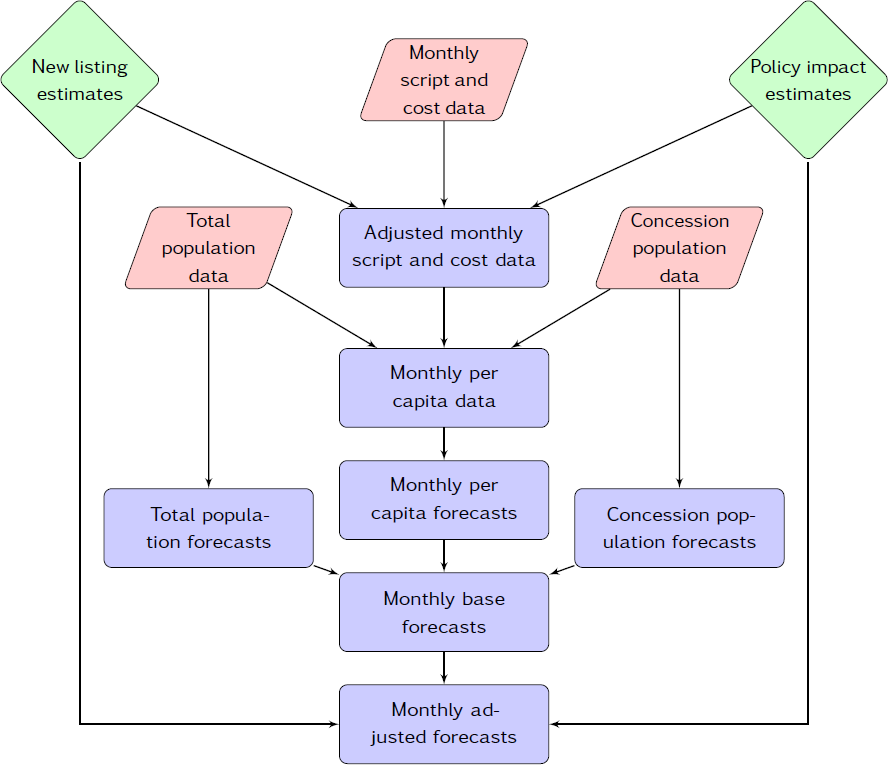

#Judgmental forecasts {#ch-judgmental}


Forecasting using judgement is very common in practice. In many cases, judgmental forecasting is the only option, such as when there is a complete lack of historical data, or when a new product is being launched, or when a new competitor enters the market, or during completely new and unique market conditions. For example, in December 2012, the Australian government was the first in the world to pass legislation that banned the use of company logos on cigarette packets, and required all cigarette packets to be a dark green colour. Judgement must be applied in order to forecast the effect of such a policy, as there are no historical precedents.

There are also situations where the data are incomplete, or only become available after some delay. For example, central banks include judgement when forecasting the current level of economic activity, a procedure known as nowcasting, as GDP is only available on a quarterly basis.

Research in this area^[@Lawrence2006] has shown that the accuracy of judgmental forecasting improves when the forecaster has (i) important domain knowledge, and (ii) more timely, up-to-date information. A judgmental approach can be quick to adjust to such changes, information or events.

Over the years, the acceptance of judgmental forecasting as a science has increased, as has the recognition of its need. More importantly, the quality of judgmental forecasts has also improved, as a direct result of recognising that improvements in judgmental forecasting can be achieved by implementing well-structured and systematic approaches. It is important to recognise that judgmental forecasting is subjective and comes with limitations. However, implementing systematic and well-structured approaches can confine these limitations and markedly improve forecast accuracy.

There are three general settings in which  judgmental forecasting is used: (i) there are no available data, so that statistical methods are not applicable and judgmental forecasting is the only feasible approach; (ii) data are available, statistical forecasts are generated, and these are then adjusted using judgement; and (iii) data are available and statistical and judgmental forecasts are generated independently and then combined. We should clarify that when data are available, applying statistical methods (such as those discussed in other chapters of this book), is preferable and should, at the very least, be used as a starting point. Statistical forecasts are generally superior to generating forecasts using only judgement. For the majority of the chapter, we focus on the first setting where no data are available, and in the very last section we discuss judgmentally adjusting statistical forecasts. We discuss combining forecasts in Section \@ref(combinations).

##Beware of limitations {#sec-3-limitations}

Judgmental forecasts are subjective, and therefore do not come free of bias or limitations.

Judgmental forecasts can be inconsistent. Unlike statistical forecasts, which can be generated by the same mathematical formulae every time, judgmental forecasts depend heavily on human cognition, and are vulnerable to its limitations. For example, a limited memory may render recent events more important than they actually are and may ignore momentous events from the more distant past; or a limited attention span may result in important information being missed; or a misunderstanding of causal relationships may lead to erroneous inferences. Furthermore, human judgement can vary due to the effect of psychological factors. One can imagine a manager who is in a positive frame of mind one day, generating forecasts that may tend to be somewhat optimistic, and in a negative frame of mind another day, generating somewhat less optimistic forecasts.

Judgement can be clouded by personal or political agendas, where targets and forecasts (as defined in Chapter \@ref(ch-intro)) are not segregated. For example, if a sales manager knows that the forecasts she generates will be used to set sales expectations (targets), she may tend to set these low in order to show a good performance (i.e., exceed the expected targets). Even in cases where targets and forecasts are well segregated, judgement may be plagued by optimism or wishful thinking. For example, it would be highly unlikely that a team working towards launching a new product would forecast its failure. As we will discuss later, this optimism can be accentuated in a group meeting setting. “Beware of the enthusiasm of your marketing and sales colleagues”^[@Fildes2007a].

Another undesirable property which is commonly seen in judgmental forecasting is the effect of anchoring. In this case, the subsequent forecasts tend to converge or be very close to an initial familiar reference point. For example, it is common to take the last observed value as a reference point. The forecaster is influenced unduly by prior information, and therefore gives this more weight in the forecasting process. Anchoring may lead to conservatism and undervaluing new and more current information, and thereby create a systematic bias.

##Key principles {#sec-3-Key-principles}

Using a systematic and well structured approach in judgmental forecasting helps to reduce the adverse effects of the limitations of judgmental forecasting, some of which we listed in the previous section. Whether this approach involves one individual or many, the following principles should be followed.

### Set the forecasting task clearly and concisely {-}

Care is needed when setting the forecasting challenges and expressing the forecasting tasks. It is important that everyone be clear about what the task is. All definitions should be clear and comprehensive, avoiding ambiguous and vague expressions. Also, it is important to avoid incorporating emotive terms and irrelevant information that may distract the forecaster. In the Delphi method that follows (see Section \@ref(sec-3-Delphi)), it may sometimes be useful to conduct a preliminary round of information gathering before setting the forecasting task.

### Implement a systematic approach {-}

Forecast accuracy and consistency can be improved by using a systematic approach to judgmental forecasting involving checklists of categories of information which are relevant to the forecasting task. For example, it is helpful to identify what information is important and how this information is to be weighted. When forecasting the demand for a new product, what factors should we account for and how should we account for them? Should it be the price, the quality and/or quantity of the competition, the economic environment at the time, the target population of the product? It is worthwhile to devote significant effort and resources to put together decision rules that will lead to the best possible systematic approach.

### Document and justify {-}

Formalising and documenting the decision rules and assumptions implemented in the systematic approach can promote consistency, as the same rules can be implemented repeatedly. Also, requesting a forecaster to document and justify their forecasts leads to accountability, which can lead to a reduced bias. Furthermore, formal documentation aids significantly in the systematic evaluation process that is suggested next.

### Systematically evaluate forecasts {-}

Systematically monitoring the forecasting process can identify unforeseen irregularities. In particular, keep records of forecasts and use them to obtain feedback as the forecasted period becomes observed. Although you may do your best as a forecaster, the environment you operate in is dynamic. Changes occur, and you need to monitor these in order to evaluate the decision rules and assumptions. Feedback and evaluation help forecasters learn and improve their forecast accuracy.

### Segregate forecasters and users {-}

Forecast accuracy may be impeded if the forecasting task is carried out by users of the forecasts, such as those responsible for implementing plans of action about which the forecast is concerned. We should clarify again here (as in Section \@ref(sec-1-2-ForPlanGoals)), that forecasting is about predicting the future as accurately as possible, given all of the information available, including historical data and knowledge of any future events that may impact the forecasts. Forecasters and users should be clearly segregated. A classic case is that of a new product being launched. The forecast should be a reasonable estimate of the sales volume of a new product, which may differ considerably from what management expects or hopes the sales will be in order to meet company financial objectives. In this case, a forecaster may be delivering a reality check to the user.

It is important that forecasters communicate forecasts to potential users thoroughly. As we will see in Section \@ref(sec-3-Adjustments), users may feel distant and disconnected from forecasts, and may not have full confidence in them. Explaining and clarifying the process and justifying the basic assumptions that led to the forecasts will provide some assurance to users.

The way in which forecasts may then be used and implemented will clearly depend on managerial decision making. For example, management may decide to adjust a forecast upwards (be over-optimistic), as the forecast may be used to guide purchasing and stock keeping levels. Such a decision may be taken after a cost-benefit analysis reveals that the cost of holding excess stock is much lower than that of lost sales. This type of adjustment should be part of setting goals or planning supply, rather than part of the forecasting process. In contrast, if forecasts are used as targets, they may be set low so that they can be exceeded more easily. Again, setting targets is different from producing forecasts, and the two should not be confused.

The example that follows comes from our experience in industry. It exemplifies two contrasting styles of judgmental forecasting — one that adheres to the principles we have just presented and one that does not.

### Example: Pharmaceutical Benefits Scheme (PBS) {-}

The Australian government subsidises the cost of a wide range of prescription medicines as part of the PBS. Each subsidised medicine falls into one of four categories: concession copayments, concession safety net, general copayments, and general safety net. Each person with a concession card makes a concession copayment per PBS medicine (\$5.80)^[These are Australian dollar amounts published by the Australian government for 2012.],
until they reach a set threshold amount labelled the concession safety net (\$348). For the rest of the financial year, all PBS-listed medicines are free. Each general patient makes a general copayment per PBS medicine (\$35.40) until the general safety net amount is reached (\$1,363.30). For the rest of the financial year, they contribute a small amount per PBS-listed medicine (\$5.80). The PBS forecasting process uses 84 groups of PBS-listed medicines, and produces forecasts of the medicine volume and the total expenditure for each group and for each of the four PBS categories, a total of 672 series. This forecasting process aids in setting the government budget allocated to the PBS, which is over \$7 billion per year, or approximately 1% of GDP.

```{r pbsdiagram, echo=FALSE, fig.cap="Process for producing PBS forecasts."}

```

Figure \@ref(fig:pbsdiagram) summarises the forecasting process. Judgmental forecasts are generated for new listings of medicines and for estimating the impact of new policies. These are shown by the green items. The pink items indicate the data used which were obtained from various government departments and associated authorities. The blue items show things that are calculated from the data provided. There were judgmental adjustments to the data to take account of new listings and new policies, and there were also judgmental adjustments to the forecasts. Because of the changing size of both the concession population and the total population, forecasts are produced on a per-capita basis, and then multiplied by the forecast population to obtain forecasts of total volume and expenditure per month.

One of us (Hyndman) was asked to evaluate the forecasting process a few years ago. We found that using judgement for new listings and new policy impacts gave better forecasts than using a statistical model alone. However, we also found that the forecasting accuracy and consistency could be improved through a more structured and systematic process, especially for policy impacts.

*Forecasting new listings:* Companies who are applying for their medicine to be added to the PBS are asked to submit detailed forecasts for various aspects of the medicine, such as projected patient numbers, market share of the new medicine, substitution effects, etc. The Pharmaceutical Benefits Advisory Committee provides guidelines describing a highly structured and systematic approach for generating these forecasts, and requires careful documentation for each step of the process. This structured process helps to reduce the likelihood and effects of deliberate self-serving biases. Two detailed evaluation rounds of the company forecasts are implemented by a sub-committee, one before the medicine is added to the PBS and one after it is added. Finally, comparisons of observations versus forecasts for some selected new listings are performed, 12 months and 24 months after the listings, and the results are sent back to the companies for comment.

*Policy impact forecasts:* In contrast to the highly structured process used for new listings, there were no systematic procedures for policy impact forecasts. On many occasions, forecasts of policy impacts were calculated by a small team, and were often heavily reliant on the work of one person. The forecasts were not usually subject to a formal review process. There were no guidelines for how to construct judgmental forecasts for policy impacts, and there was often a lack of adequate documentation about how these forecasts were obtained, the assumptions underlying them, etc.

Consequently, we recommended several changes:

 - that guidelines for forecasting new policy impacts be developed, to encourage a more systematic and structured forecasting approach;
 - that the forecast methodology be documented in each case, including all assumptions made in forming the forecasts;
 - that new policy forecasts be made by at least two people from different areas of the organisation;
 - that a review of forecasts be conducted one year after the implementation of each new policy by a review committee, especially for new policies that have a significant annual projected cost or saving. The review committee should include those involved in generating the forecasts, but also others.

These recommendations reflect the principles outlined in Section \@ref(sec-3-Key-principles).

##The Delphi method {#sec-3-Delphi}


The Delphi method was invented by Olaf Helmer and Norman Dalkey of the Rand Corporation in the 1950s for the purpose of addressing a specific military problem. The method relies on the key assumption that forecasts from a group are generally more accurate than those from individuals. The aim of the Delphi method is to construct consensus forecasts from a group of experts in a structured iterative manner. A facilitator is appointed in order to implement and manage the process. The Delphi method generally involves the following stages:

  1. A panel of experts is assembled.
  2. Forecasting tasks/challenges are set and distributed to the experts.
  3. Experts return initial forecasts and justifications. These are compiled and summarised in order to provide feedback.
  4. Feedback is provided to the experts, who now review their forecasts in light of the feedback. This step may be iterated until a satisfactory level of consensus is reached.
  5. Final forecasts are constructed by aggregating the experts’ forecasts.

Each stage of the Delphi method comes with its own challenges. In what follows, we provide some suggestions and discussions about each one of these.^[For further reading, refer to: @Rowe2007; @RW99]

### Experts and anonymity {-}

The first challenge of the facilitator is to identify a group of experts who can contribute to the forecasting task. The usual suggestion is somewhere between 5 and 20 experts with diverse expertise. Experts submit forecasts and also provide detailed qualitative justifications for these.

A key feature of the Delphi method is that the participating experts remain anonymous at all times. This means that the experts cannot be influenced by political and social pressures in their forecasts. Furthermore, all experts are given an equal say and all are held accountable for their forecasts. This avoids the situation where a group meeting is held and some members do not contribute, while others dominate. It also prevents members exerting undue influence based on seniority or personality. There have been suggestions that even something as simple as the seating arrangements in a group setting can influence the group dynamics. Furthermore, there is ample evidence that a group meeting setting promotes enthusiasm and influences individual judgement, leading to optimism and overconfidence.^[@Buehler2005]

A byproduct of anonymity is that the experts do not need to meet as a group in a physical location. An important advantage of this is that it increases the likelihood of gathering experts with diverse skills and expertise from varying locations. Furthermore, it makes the process cost-effective by eliminating the expense and inconvenience of travel, and it makes it flexible, as the experts only have to meet a common deadline for submitting forecasts, rather than having to set a common meeting time.

### Setting the forecasting task in a Delphi {-}

In a Delphi setting, it may be useful to conduct a preliminary round of information gathering from the experts before setting the forecasting tasks. Alternatively, as experts submit their initial forecasts and justifications, valuable information which is not shared between all experts can be identified by the facilitator when compiling the feedback.

### Feedback {-}

Feedback to the experts should include summary statistics of the forecasts and outlines of qualitative justifications. Numerical data summaries and graphical representations can be used to summarise the experts’ forecasts.

As the feedback is controlled by the facilitator, there may be scope to direct attention and information from the experts to areas where it is most required. For example, the facilitator may direct the experts’ attention to responses that fall outside the interquartile range, and the qualitative justification for such forecasts.

### Iteration {-}

The process of the experts submitting forecasts, receiving feedback, and reviewing their forecasts in light of the feedback, is repeated until a satisfactory level of consensus between the experts is reached. Satisfactory consensus does not mean complete convergence in the forecast value; it simply means that the variability of the responses has decreased to a satisfactory level. Usually two or three rounds are sufficient. Experts are more likely to drop out as the number of iterations increases, so too many rounds should be avoided.

### Final forecasts {-}

The final forecasts are usually constructed by giving equal weight to all of the experts’ forecasts. However, the facilitator should keep in mind the possibility of extreme values which can distort the final forecast.

### Limitations and variations {-}

Applying the Delphi method can be time consuming. In a group meeting, final forecasts can possibly be reached in hours or even minutes — something which is almost impossible to do in a Delphi setting. If it is taking a long time to reach a consensus in a Delphi setting, the panel may lose interest and cohesiveness.

In a group setting, personal interactions can lead to quicker and better clarifications of qualitative justifications. A variation of the Delphi method which is often applied is the "estimate-talk-estimate" method, where the experts can interact between iterations, although the forecast submissions can still remain anonymous. A disadvantage of this variation is the possibility of the loudest person exerting undue influence.

### The facilitator {-}

The role of the facilitator is of the utmost importance. The facilitator is largely responsible for the design and administration of the Delphi process. The facilitator is also responsible for providing feedback to the experts and generating the final forecasts. In this role, the facilitator needs to be experienced enough to recognise areas that may need more attention, and to direct the experts' attention to these. Also, as there is no face-to-face interaction between the experts, the facilitator is responsible for disseminating important information. The efficiency and effectiveness of the facilitator can dramatically increase the probability of a successful Delphi method in a judgmental forecasting setting.

##Forecasting by analogy {#sec-3-Analogy}

A useful judgmental approach which is often implemented in practice is forecasting by analogy. A common example is the pricing of a house through an appraisal process. An appraiser estimates the market value of a house by comparing it to similar properties that have sold in the area. The degree of similarity depends on the attributes considered. With house appraisals, attributes such as land size, dwelling size, numbers of bedrooms and bathrooms, and garage space are usually considered.

Even thinking and discussing analogous products or situations can generate useful (and sometimes crucial) information. We illustrate this point with the following example.^[This example is extracted from @Kahneman1993]

### Example: Designing a high school curriculum {-}

A small group of academics and teachers were assigned the task of developing a curriculum for teaching judgement and decision making under uncertainty for high schools in Israel. Each group member was asked to forecast how long it would take for the curriculum to be completed. Responses ranged between 18 and 30 months. One of the group members who was an expert in curriculum design was asked to consider analogous curricula developments around the world. He concluded that 40% of analogous groups he considered never completed the task. The rest took between 7 to 10 years. The Israel project was completed in 8 years.

Obviously, forecasting by analogy comes with challenges. We should aspire to base forecasts on multiple analogies rather than a single analogy, which may create biases. However, these may be challenging to identify. Similarly, we should aspire to consider multiple attributes. Identifying or even comparing these may not always be straightforward. As always, we suggest performing these comparisons and the forecasting process using a systematic approach. Developing a detailed scoring mechanism to rank attributes and record the process of ranking will always be useful.

### A structured analogy {-}

Alternatively, a structured approach comprising a panel of experts can be implemented, as was proposed by @Green2007. The concept is similar to that of a Delphi; however, the forecasting task is completed by considering analogies. First, a facilitator is appointed. Then the structured approach involves the following steps.

  1. A panel of experts who are likely to have experience with analogous situations is assembled.
  2. Tasks/challenges are set and distributed to the experts.
  3. Experts identify and describe as many analogies as they can, and generate forecasts based on each analogy.
  4. Experts list similarities and differences of each analogy to the target situation, then rate the similarity of each analogy to the target situation on a scale.
  5. Forecasts are derived by the facilitator using a set rule. This can be a weighted average, where the weights can be guided by the ranking scores of each analogy by the experts.

As with the Delphi approach, anonymity of the experts may be an advantage in not suppressing creativity, but could hinder collaboration. Green and Armstrong found no gain in collaboration between the experts in their results. A key finding was that experts with multiple analogies (more than two), and who had direct experience with the analogies, generated the most accurate forecasts.

##Scenario Forecasting {#sec-3-Scenario}

A fundamentally different approach to judgmental forecasting is scenario-based forecasting. The aim of this approach is to generate forecasts based on plausible scenarios. In contrast to the two previous approaches (Delphi and forecasting by analogy) where the resulting forecast is intended to be a likely outcome, each scenario-based forecast may have a low probability of occurrence. The scenarios are generated by considering all possible factors or drivers, their relative impacts, the interactions between them, and the targets to be forecasted.

Building forecasts based on scenarios allows a wide range of possible forecasts to be generated and some extremes to be identified. For example it is usual for “best”, “middle” and “worst” case scenarios to be presented, although many other scenarios will be generated. Thinking about and documenting these contrasting extremes can lead to early contingency planning.

With scenario forecasting, decision makers often participate in the generation of scenarios. While this may lead to some biases, it can ease the communication of the scenario-based forecasts, and lead to a better understanding of the results.

##New product forecasting {#sec-3-NPF}

The definition of a new product can vary. It may be an entirely new product which has been launched, a variation of an existing product (“new and improved”), a change in the pricing scheme of an existing product, or even an existing product entering a new market.

Judgmental forecasting is usually the only available method for new product forecasting, as historical data are unavailable. The approaches we have already outlined (Delphi, forecasting by analogy and scenario forecasting) are all applicable when forecasting the demand for a new product.

Other methods which are more specific to the situation are also available. We briefly describe three such methods which are commonly applied in practice. These methods are less structured than those already discussed, and are likely to lead to more biased forecasts as a result.

### Sales force composite {-}

In this approach, forecasts for each outlet/branch/store of a company are generated by salespeople, and are then aggregated. This usually involves sales managers forecasting the demand for the outlet they manage. Salespeople are usually closest to the interaction between customers and products, and often develop an intuition about customer purchasing intentions. They bring this valuable experience and expertise to the forecast.

However, having salespeople generate forecasts violates the key principle of segregating forecasters and users, which can create biases in many directions. It is very common for the performance of a salesperson to be evaluated against the sales forecasts or expectations set beforehand. In this case, the salesperson acting as a forecaster may introduce some self-serving bias by generating low forecasts. On the other hand, one can imagine a very enthusiastic salesperson, full of optimism, generating high forecasts.

Moreover a successful salesperson is not necessarily a successful nor  well-informed forecaster. A large proportion of salespeople will have no or very limited formal training in forecasting. Finally, salespeople will feel customer displeasure at first hand if, for example, the product runs out or is not introduced in their store. Such interactions will cloud their judgement.

### Executive opinion {-}

In contrast to the sales force composite, this approach involves staff at the top of the managerial structure generating aggregate forecasts. Such forecasts are usually generated in a group meeting, where executives contribute information from their own area of the company. Having executives from different functional areas of the company promotes great skill and knowledge diversity in the group.

This process carries all of the advantages and disadvantages of a group meeting setting which we discussed earlier. In this setting, it is important to justify and document the forecasting process. That is, executives need to be held accountable in order to reduce the biases generated by the group meeting setting. There may also be scope to apply variations to a Delphi approach in this setting; for example, the estimate-talk-estimate process described earlier.

### Customer intentions  {-}

Customer intentions can be used to forecast the demand for a new product or for a variation on an existing product. Questionnaires are filled in by customers on their intentions to buy the product. A structured questionnaire is used, asking customers to rate the likelihood of them purchasing the product on a scale; for example, highly likely, likely, possible, unlikely, highly unlikely.

Survey design challenges, such as collecting a representative sample, applying a time- and cost-effective method, and dealing with non-responses, need to be addressed.^[@Groves2009]

Furthermore, in this survey setting we must keep in mind the relationship between purchase intention and purchase behaviour. Customers do not always do what they say they will. Many studies have found a positive correlation between purchase intentions and purchase behaviour; however, the strength of these correlations varies substantially. The factors driving this variation include the timings of data collection and product launch, the definition of “new” for the product, and the type of industry. Behavioural theory tells us that intentions predict behaviour if the intentions are measured just before the behaviour.^[@RW94] The time between intention and behaviour will vary depending on whether it is a completely new product or a variation on an existing product. Also, the correlation between intention and behaviour is found to be stronger for variations on existing and familiar products than for completely new products.

Whichever method of new product forecasting is used, it is important to thoroughly document the forecasts made, and the reasoning behind them, in order to be able to evaluate them when data become available.

##Judgmental adjustments {#sec-3-Adjustments}

In this final section, we consider the situation where historical data are available and are used to generate statistical forecasts. It is common for practitioners to then apply judgmental adjustments to these forecasts. These adjustments can potentially provide all of the advantages of judgmental forecasting which have been discussed earlier in this chapter. For example, they provide an avenue for incorporating factors that may not be accounted for in the statistical model, such as promotions, large sporting events, holidays, or recent events that are not yet reflected in the data. However, these advantages come to fruition only when the right conditions are present. Judgmental adjustments, like judgmental forecasts, come with biases and limitations, and we must implement methodical strategies in order to minimise them.

### Use adjustments sparingly {-}

Practitioners adjust much more often than they should, and many times for the wrong reasons. By adjusting statistical forecasts, users of forecasts create a feeling of ownership and credibility. Users often do not understand or appreciate the mechanisms that generate the statistical forecasts (as they will usually have no training in this area). By implementing judgmental adjustments, users feel that they have contributed to and completed the forecasts, and they can now relate their own intuition and interpretations to these. The forecasts have become their own.

Judgmental adjustments should not aim to correct for a systematic pattern in the data that is thought to have been missed by the statistical model. This has been proven to be ineffective, as forecasters tend to read non-existent patterns in noisy series. Statistical models are much better at taking account of data patterns, and judgmental adjustments only hinder accuracy.

Judgmental adjustments are most effective when there is significant additional information at hand or strong evidence of the need for an adjustment. We should only adjust when we have important extra information which is not incorporated in the statistical model. Hence, adjustments seem to be most accurate when they are large in size. Small adjustments (especially in the positive direction promoting the illusion of optimism) have been found to hinder accuracy, and should be avoided.

### Apply a structured approach {-}

Using a structured and systematic approach will improve the accuracy of judgmental adjustments. Following the key principles outlined in Section \@ref(sec-3-Key principles) is vital. In particular, having to document and justify adjustments will make it more challenging to override the statistical forecasts, and will guard against unnecessary adjustments.

It is common for adjustments to be implemented by a panel (see the example that follows). Using a Delphi setting carries great advantages. However, if adjustments are implemented in a group meeting, it is wise to consider the forecasts of key markets or products first, as panel members will get tired during this process. Fewer adjustments tend to be made as the meeting goes on through the day.

### Example: Tourism Forecasting Committee (TFC) {-}

Tourism Australia publishes forecasts for all aspects of Australian tourism twice a year. The published forecasts are generated by the TFC, an independent body which comprises experts from various government and private industry sectors; for example, the Australian Commonwealth Treasury, airline companies, consulting firms, banking sector companies, and tourism bodies.

The forecasting methodology applied is an iterative process. First, model-based statistical forecasts are generated by the forecasting unit within Tourism Australia, then judgmental adjustments are made to these in two rounds. In the first round, the TFC Technical Committee^[GA was an observor on this technical committee for a few years.] (comprising senior researchers, economists and independent advisors) adjusts the model-based forecasts. In the second and final round, the TFC (comprising industry and government experts) makes final adjustments. In both rounds, adjustments are made by consensus.

```{r tfc, fig.cap="Long run annual forecasts for domestic visitor nights for Australia. We study regression models in Chapter 5, and ETS (ExponenTial Smoothing) models in Chapter 7.", warning=FALSE, echo=FALSE}
tfcvn <- read.csv(file="dat_3_TFC.csv",header=TRUE)
tfcvn <- ts(tfcvn[,-1],start=1998)/1000
colnames(tfcvn) <- c("Observed data",
    "TFC forecasts",
    "Regression model forecasts",
    "ETS model forecasts")
autoplot(tfcvn) + xlab("Year") +
  ylab("Total visitor nights (thousands)") +
  scale_colour_manual(name="",
    values=c("#000000","#E69F00", "#56B4E9", "#CC79A7"),
    breaks=colnames(tfcvn))
```

In 2008, we [@austourism] analysed forecasts for Australian domestic tourism. We concluded that the published TFC forecasts were optimistic, especially for the long-run, and we proposed alternative model-based forecasts. We now have access to observed data up to and including 2011. In Figure \ref{fig-3-tfc}, we plot the published forecasts against the actual data. We can see that the published TFC forecasts have continued to be optimistic.

What can we learn from this example? Although the TFC clearly states in its methodology that it produces 'forecasts' rather than 'targets', could this be a case where these have been confused? Are the forecasters and users sufficiently well-segregated in this process? Could the iterative process itself be improved? Could the adjustment process in the meetings be improved? Could it be that the group meetings have promoted optimism? Could it be that domestic tourism should have been considered earlier in the day?


## Further reading

### Books {-}

 * @Ord2012
 * @GW04
 * @Kahn2006

### General papers {-}

 * @Fildes2007a
 * @Fildes2007
 * @Harvey2001

### Delphi {-}

 * @RW99
 * @Rowe2007

### Adjustments {-}

 * @Sanders2005
 * @Eroglu2010
 * @Franses2013
 * @Goodwin00

### Analogy {-}

 * @Green2007

### Scenarios {-}

 * @Onkal2012

### Customer intentions {-}

 * @Morwitz2007

