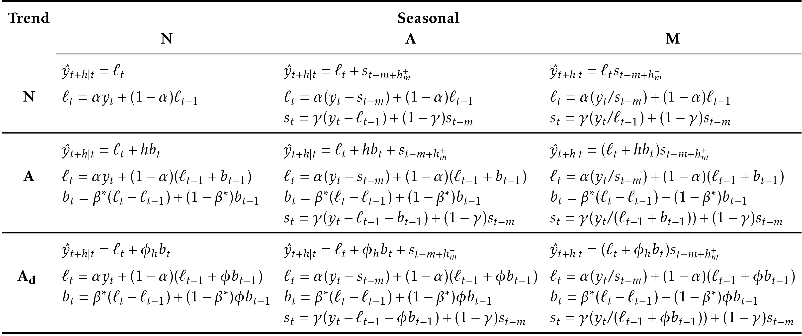
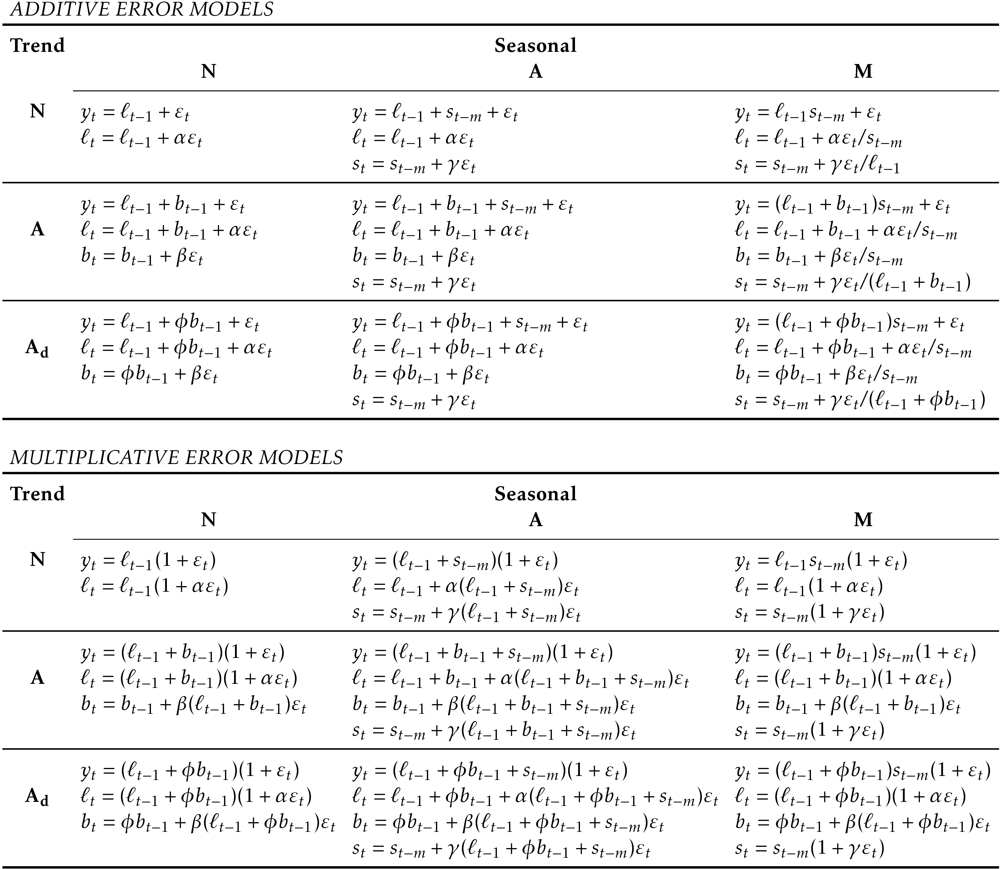

#Exponential smoothing {#ch-expsmooth}

Exponential smoothing was proposed in the late 1950s (@Brown59, @Holt57, and @Winters60 are key pioneering works), and has motivated some of the most successful forecasting methods. Forecasts produced using exponential smoothing methods are weighted averages of past observations, with the weights decaying exponentially as the observations get older. In other words, the more recent the observation the higher the associated weight. This framework generates reliable forecasts quickly and for a wide range of time series, which is a great advantage and of major importance to applications in industry.

This chapter is divided into two parts. In the first part (Sections \@ref(sec-7-1-SES)--\@ref(sec-7-6-Taxonomy)) we present the mechanics of the most important exponential smoothing methods, and their application in forecasting time series with various characteristics. This helps us develop an intuition to how these methods work. In this setting, selecting and using a forecasting method may appear to be somewhat ad hoc. The selection of the method is generally based on recognising key components of the time series (trend and seasonal) and the way in which these enter the smoothing method (e.g., in an additive, damped or multiplicative manner).

In the second part of the chapter (Section \@ref(sec-7-ETS)) we present the statistical models that underlie exponential smoothing methods. These models generate identical point forecasts to the methods discussed in the first part of the chapter, but also generate prediction intervals. Furthermore, this statistical framework allows for genuine model selection between competing models.

##Simple exponential smoothing {#sec-7-1-SES}

The simplest of the exponentially smoothing methods is naturally called "simple exponential smoothing" (SES)^[In some books it is called ``single exponential smoothing'']. This method is suitable for forecasting data with no clear trend or seasonal pattern. For example, the data in Figure \@ref(fig:7-oil) do not display any clear trending behaviour or any seasonality. (There is a rise in the last few years, which might suggest a trend. We will consider whether a trended method would be better for this series later in this chapter.) We have already considered the naïve and the average as possible methods for forecasting such data (Section \@ref(sec-2-methods)).

```{r 7-oil, fig.cap="Oil production in Saudi Arabia from 1980 to 2013.", echo=TRUE}
oildata <- window(oil, start=1996)
autoplot(oildata) +
  ylab("Oil (millions of tonnes)") + xlab("Year")
```

Using the naïve method, all forecasts for the future are equal to the last observed value of the series,
$$
  \hat{y}_{T+h|T} = y_{T},
$$
for $h=1,2,\dots$. Hence, the naïve method assumes that the most recent observation is the only important one, and all previous observations provide no information for the future. This can be thought of as a weighted average where all of the weight is given to the last observation.

Using the average method, all future forecasts are equal to a simple average of the observed data,
$$
  \hat{y}_{T+h|T} = \frac1T \sum_{t=1}^T y_t,
$$
for $h=1,2,\dots$. Hence, the average method assumes that all observations are of equal importance, and gives them equal weights when generating forecasts.

We often want something between these two extremes. For example, it may be sensible to attach larger weights to more recent observations than to observations from the distant past. This is exactly the concept behind simple exponential smoothing. Forecasts are calculated using weighted averages, where the weights decrease exponentially as observations come from further in the past --- the smallest weights are associated with the oldest observations:
\begin{equation}
  \hat{y}_{T+1|T} = \alpha y_T + \alpha(1-\alpha) y_{T-1} + \alpha(1-\alpha)^2 y_{T-2}+ \alpha(1-\alpha)^3 y_{T-3}+\cdots,   (\#eq:7-ses)
\end{equation}
where $0 \le \alpha \le 1$ is the smoothing parameter. The one-step-ahead forecast for time $T+1$ is a weighted average of all of the observations in the series $y_1,\dots,y_T$. The rate at which the weights decrease is controlled by the parameter $\alpha$.

Table \@ref(tab:alpha) shows the weights attached to observations for four different values of $\alpha$ when forecasting using simple exponential smoothing. Note that the sum of the weights even for a small value of $\alpha$ will be approximately one for any reasonable sample size.

```{r alpha, echo=FALSE}
tab <- as.data.frame(matrix(NA,nrow=6,ncol=4))
rownames(tab) <- c("$y_{T}$", paste("$y_{T-",1:5,"}$",sep=''))
alpha <- c(0.2,0.4,0.6,0.8)
colnames(tab) <- paste("$\\alpha=",alpha,"$",sep="")
for(i in 1:6)
  tab[i,] <- alpha*(1-alpha)^(i-1)
knitr::kable(tab, digits=4,booktabs=TRUE,
             caption="Exponentially decaying weights attached to observations of the time series when generating forecasts using simple exponential smoothing.")
```

For any $\alpha$ between 0 and 1, the weights attached to the observations decrease exponentially as we go back in time, hence the name "exponential smoothing". If $\alpha$ is small (i.e., close to 0), more weight is given to observations from the more distant past. If $\alpha$ is large (i.e., close to 1), more weight is given to the more recent observations. For the extreme case where $\alpha=1$, $\hat{y}_{T+1|T}=y_T$, and the forecasts are equal to the naïve forecasts.

We present two equivalent forms of simple exponential smoothing, each of which leads to the forecast equation \@ref(eq:7-ses).

### Weighted average form {-}

The forecast at time $t+1$ is equal to a weighted average between the most recent observation $y_t$ and the most recent forecast $\hat{y}_{t|t-1}$,
$$
 \hat{y}_{t+1|t} = \alpha y_t + (1-\alpha) \hat{y}_{t|t-1}
$$
for $t=1,\dots,T$, where $0 \le \alpha \le 1$ is the smoothing parameter.

The process has to start somewhere, so we let the first forecast of $y_1$ be denoted by $\ell_0$ (which we will have to estimate). Then
\begin{align*}
  \hat{y}_{2|1} &= \alpha y_1 + (1-\alpha) \ell_0\\
  \hat{y}_{3|2} &= \alpha y_2 + (1-\alpha) \hat{y}_{2|1}\\
  \hat{y}_{4|3} &= \alpha y_3 + (1-\alpha) \hat{y}_{3|2}\\
  \vdots\\
  \hat{y}_{T+1|T} &= \alpha y_T + (1-\alpha) \hat{y}_{T|T-1}.
\end{align*}
Substituting each equation into the following equation, we obtain
\begin{align*}
  \hat{y}_{3|2}   & = \alpha y_2 + (1-\alpha) \left[\alpha y_1 + (1-\alpha) \ell_0\right]              \\
                 & = \alpha y_2 + \alpha(1-\alpha) y_1 + (1-\alpha)^2 \ell_0                          \\
  \hat{y}_{4|3}   & = \alpha y_3 + (1-\alpha) [\alpha y_2 + \alpha(1-\alpha) y_1 + (1-\alpha)^2 \ell_0]\\
                 & = \alpha y_3 + \alpha(1-\alpha) y_2 + \alpha(1-\alpha)^2 y_1 + (1-\alpha)^3 \ell_0 \\
                 & ~~\vdots                                                                           \\
  \hat{y}_{T+1|T} & =  \sum_{j=0}^{T-1} \alpha(1-\alpha)^j y_{T-j} + (1-\alpha)^T \ell_{0}.
\end{align*}
The last term becomes tiny for large $T$. So, the weighted average form leads to the same forecast equation \@ref(eq:7-ses).

### Component form {-}

An alternative representation is the component form. For simple exponential smoothing, the only component included is the level, $\ell_t$. (Other methods which are considered later in this chapter may also include a trend $b_t$ and a seasonal component $s_t$.) Component form representations of exponential smoothing methods comprise a forecast equation and a smoothing equation for each of the components included in the method. The component form of simple exponential smoothing is given by:
\begin{align*}
  \text{Forecast equation}  && \hat{y}_{t+1|t} & = \ell_{t}\\
  \text{Smoothing equation} && \ell_{t}        & = \alpha y_{t} + (1 - \alpha)\ell_{t-1},
\end{align*}
where $\ell_{t}$ is the level (or the smoothed value) of the series at time $t$. The forecast equation shows that the forecast value at time $t+1$ is the estimated level at time $t$. The smoothing equation for the level (usually referred to as the level equation) gives the estimated level of the series at each period $t$.

Applying the forecast equation for time $T$ gives $\hat{y}_{T+1|T} = \ell_{T}$, the most recent estimated level.

If we replace $\ell_t$ with $\hat{y}_{t+1|t}$ and $\ell_{t-1}$ with $\hat{y}_{t|t-1}$ in the smoothing equation, we will recover the weighted average form of simple exponential smoothing.

The component form of simple exponential smoothing is not particularly useful, but it will be the easiest form to use when we start adding other components.

### Multi-horizon Forecasts {-}

So far, we have only given forecast equations for one step ahead. Simple exponential smoothing has a "flat" forecast function, and therefore for longer forecast horizons,
$$
 \hat{y}_{T+h|T} = \hat{y}_{T+1|T}=\ell_T, \qquad h=2,3,\dots.
$$
Remember that these forecasts will only be suitable if the time series has no trend or seasonal component.

### Optimization {-}

The application of every exponential smoothing method requires the smoothing parameters and the initial values to be chosen. In particular, for simple exponential smoothing, we need to select the values of $\alpha$ and $\ell_0$. All forecasts can be computed from the data once we know those values. For the methods that follow there is usually more than one smoothing parameter and more than one initial component to be chosen.

In some cases, the smoothing parameters may be chosen in a subjective manner --- the forecaster specifies the value of the smoothing parameters based on previous experience. However, a more reliable and objective way to obtain values for the unknown parameters is to estimate them from the observed data.

In Section \@ref(Regr-LSprinciple), we estimated the coefficients of a regression model by minimizing the sum of the squared errors (SSE). Similarly, the unknown parameters and the initial values for any exponential smoothing method can be estimated by minimizing the SSE. The errors are specified as $e_t=y_t - \hat{y}_{t|t-1}$ for $t=1,\dots,T$ (the one-step-ahead training errors). Hence, we find the values of the unknown parameters and the initial values that minimize
\begin{equation}
 \text{SSE}=\sum_{t=1}^T(y_t - \hat{y}_{t|t-1})^2=\sum_{t=1}^Te_t^2. (\#eq:7-SSE)
\end{equation}

Unlike the regression case (where we have formulas which return the values of the regression coefficients that minimize the SSE), this involves a non-linear minimization problem, and we need to use an optimization tool to solve it.

### Example: Oil production {-}


In this example, simple exponential smoothing is applied to forecast oil production in Saudi Arabia.

```{r sesfit, echo=TRUE}
oildata <- window(oil, start=1996)
# Estimate parameters
fc <- ses(oildata, h=5)
# Accuracy of one-step-ahead training errors over period 1--12
round(accuracy(fc),2)
```

```{r sesparam, echo=FALSE}
#tmp <- accuracy(fc)
#print(round(c(tmp[,c("MAE","RMSE","MAPE")],SSE=sum(residuals(fc)^2)),1))
alpha <- fc$model$par[1]
l0 <- fc$model$par[2]
```

This gives parameters $\alpha=`r format(alpha,digits=2,nsmall=2)`$ and
$\ell_0=`r format(l0,digits=1,nsmall=1)`$, obtained by minimizing SSE (equivalently RMSE) over periods $t=1,2,\dots,12$, subject to the restriction that $0\le\alpha\le1$.

In Table \@ref(tab:oilses) we demonstrate the calculation using these parameters. The second last column shows the estimated level for times $t=0$ to $t=12$; the last few rows of the last column show the forecasts for $h=1,2,3$.


```{r oilses, echo=FALSE}
# Data set for table
x <- oildata
# Generate forecasts
fc <- ses(x, h=3)
# Now set up the table
n <- length(x)
year0 <- min(time(x))-1
tab <- matrix(NA,nrow=n+6,ncol=5)
colnames(tab) <- c("Year","Time","Observation","Level","Forecast")
tab[2:(n+6),1] <- year0 + 0:(n+4)
tab[2:(n+6),2] <- 0:(n+4)
# Add data, level and fitted values
tab[3:(n+2),3] <- x
tab[2:(n+2),4] <- fc$model$state
tab[3:(n+2),5] <- fitted(fc)
# Add forecasts
tab[n+(4:6),1] <- max(time(x))+1:3
tab[n+(4:6),2] <- 1:3
tab[n+(4:6),5] <- fc$mean
# Convert to characters
tab <- as.data.frame(tab)
class(tab$Year) <- class(tab$Time) <- "integer"
tab <- format(tab, digits=5)
# Remove missing values
tab <- apply(tab, 2, function(x){j <- grep("[ ]*NA",x); x[j] <- ""; return(x)})
# Add math notation rows
tab[1,] <- c("","$t$","$y_t$","$\\ell_t$","$\\hat{y}_{t+1|t}$")
tab[n+3,] <- c("","$h$","","","$\\hat{y}_{T+h|T}$")
# Show table
knitr::kable(tab, caption="Forecasting the total oil production in millions of tonnes for Saudi Arabia using simple exponential smoothing.", booktabs=TRUE)
```

The black line in Figure \@ref(fig:ses) is a plot of the data, which shows a changing level over time.


```{r ses, fig.cap="Simple exponential smoothing applied to oil production in Saudi Arabia (1996--2013).", echo=TRUE}
autoplot(fc) +
  forecast::autolayer(fitted(fc), series="Fitted") +
  ylab("Oil (millions of tonnes)") + xlab("Year")
```

The forecasts for the period 2014--2018 are plotted in Figure \@ref(fig:ses). Also plotted are one-step-ahead fitted values alongside the data over the period 1996--2013. The large value of $\alpha$ in this example is reflected in the large adjustment that takes place in the estimated level $\ell_t$ at each time. A smaller value of $\alpha$ would lead to smaller changes over time, and so the series of fitted values would be smoother.

The prediction intervals shown here are calculated using the methods described in Section \@ref(sec-7-ETS). The prediction intervals show that there is considerable uncertainty in the future values of oil production over the five-year forecast period. So interpreting the point forecasts without accounting for the large uncertainty can be very misleading.

## Trend methods {#sec-7-trendmethods}

###Holt’s linear trend method {-}

@Holt57 extended simple exponential smoothing to allow the forecasting of data with a trend. This method involves a forecast equation and two smoothing equations (one for the level and one for the trend):
\begin{align*}
  \text{Forecast equation}&& \hat{y}_{t+h|t} &= \ell_{t} + hb_{t} \\
  \text{Level equation}   && \ell_{t} &= \alpha y_{t} + (1 - \alpha)(\ell_{t-1} + b_{t-1})\\
  \text{Trend equation}   && b_{t}    &= \beta^*(\ell_{t} - \ell_{t-1}) + (1 -\beta^*)b_{t-1},
\end{align*}
where $\ell_t$ denotes an estimate of the level of the series at time $t$, $b_t$ denotes an estimate of the trend (slope) of the series at time $t$, $\alpha$ is the smoothing parameter for the level, $0\le\alpha\le1$, and $\beta^*$ is the smoothing parameter for the trend, $0\le\beta^*\le1$. (We denote this as $\beta^*$ instead of $\beta$ for reasons that will be explained in Section \@ref(sec-7-ETS).)

As with simple exponential smoothing, the level equation here shows that $\ell_t$ is a weighted average of observation $y_t$ and the one-step-ahead training forecast for time $t$, here given by $\ell_{t-1} + b_{t-1}$. The trend equation shows that $b_t$ is a weighted average of the estimated trend at time $t$ based on $\ell_{t} - \ell_{t-1}$ and $b_{t-1}$, the previous estimate of the trend.

The forecast function is no longer flat but trending. The $h$-step-ahead forecast is equal to the last estimated level plus $h$ times the last estimated trend value. Hence the forecasts are a linear function of $h$.

### Example: Air Passengers {-}

```{r airholt0, echo=TRUE, fig.cap="Total annual passengers of air carriers registered in Australia. 1990-2014."}
air <- window(ausair, start=1990)
autoplot(air) +
 ggtitle("Air passengers in Australia") +
  xlab("Year") + ylab("millions of passengers")
```

Figure \@ref(fig:airholt0) shows annual passenger numbers for Australian airlines. In Table \@ref(tab:airholt) we demonstrate the application of Holt’s method to these data. The smoothing parameters, $\alpha$ and $\beta$, and the initial values $\ell_0$ and $b_0$ are estimated by minimizing the SSE for the one-step training errors as in Section \@ref(sec-7-1-SES).

```{r airholt1, echo=TRUE}
fc <- holt(air, h=5)
```

```{r airholt, echo=FALSE}
# Now set up table
tmp <- cbind(air, fc$model$state, fitted(fc))
tsp(tmp) <- NULL
tmp <- cbind(1989:2016,0:(NROW(tmp)-1),tmp)
tmp <- rbind(rep(NA,6),tmp, matrix(NA, nrow=6, ncol=ncol(tmp)))
colnames(tmp) <- c("Year","Time","Observation","Level","Slope","Forecast")
# Add in forecasts
tmp[31:35,6] <- fc$mean[1:5]
tmp[31:35,2] <- 1:5
# Convert to characters
tmp <- as.data.frame(tmp)
class(tmp[["Year"]]) <- class(tmp[["Time"]]) <- "integer"
tmp <- format(tmp, digits=4)
# Remove missing values
tmp <- apply(tmp, 2, function(x){j <- grep("[ ]*NA",x); x[j] <- ""; return(x)})
# Add math notation
tmp[1,] <- c("","$t$","$y_t$","$\\ell_t$",
                   "$b_t$", "$\\hat{y}_{t|t-1}$")
tmp[30,] <- c("","$h$","","","", "$\\hat{y}_{t+h|t}$")
knitr::kable(tmp, booktabs=TRUE,
             caption="Applying Holt's linear method with $\\alpha=0.8321$ and $\\beta^*=0.0001$ to Australian air passenger data (millions of passengers).")
```

```{r checkholt, echo=FALSE}
if(sum(abs(fc$model$par[1:2] - c(0.8302,0.0001))) > 1e-4)
  stop("Parameter error")
```

The very small value of $\beta^*$ means that the slope hardly changes over time. Figure \@ref(fig:dampedtrend) shows the forecasts for years 2014--2018.

###Damped trend methods {-}

The forecasts generated by Holt’s linear method display a constant trend (increasing or decreasing) indefinitely into the future. Empirical evidence indicates that these methods tend to over-forecast, especially for longer forecast horizons. Motivated by this observation, @GarMacK1985 introduced a parameter that "dampens" the trend to a flat line some time in the future. Methods that include a damped trend have proven to be very successful, and are arguably the most popular individual methods when forecasts are required automatically for many series.

In conjunction with the smoothing parameters $\alpha$ and $\beta^*$ (with values between 0 and 1 as in Holt’s method), this method also includes a damping parameter $0<\phi<1$:
\begin{align*}
  \hat{y}_{t+h|t} &= \ell_{t} + (\phi+\phi^2 + \dots + \phi^{h})b_{t} \\
  \ell_{t} &= \alpha y_{t} + (1 - \alpha)(\ell_{t-1} + \phi b_{t-1})\\
  b_{t} &= \beta^*(\ell_{t} - \ell_{t-1}) + (1 -\beta^*)\phi b_{t-1}.
\end{align*}
If $\phi=1$, the method is identical to Holt’s linear method. For values between $0$ and $1$, $\phi$ dampens the trend so that it approaches a constant some time in the future. In fact, the forecasts converge to $\ell_T+\phi b_T/(1-\phi)$ as $h\rightarrow\infty$ for any value $0<\phi<1$. This means that short-run forecasts are trended while long-run forecasts are constant.

In practice, $\phi$ is rarely less than 0.8 as the damping has a very strong effect for smaller values. Values of $\phi$ close to 1 will mean that a damped model is not able to be distinguished from a non-damped model. For these reasons, we usually restrict $\phi$ to a minimum of 0.8 and a maximum of 0.98.

### Example: Air Passengers (continued) {-}

Figure \@ref(fig:dampedtrend) shows the forecasts for years 2014--2018 generated from Holt’s linear trend method and the damped trend method.

```{r dampedtrend, fig.cap="Forecasting Air Passengers in Australia (millions of passengers). For the damped trend method, $\\phi=0.90$.", echo=TRUE}
fc <- holt(air, h=15)
fc2 <- holt(air, damped=TRUE, phi = 0.9, h=15)
autoplot(air) +
  forecast::autolayer(fc$mean, series="Holt's method") +
  forecast::autolayer(fc2$mean, series="Damped Holt's method") +
  ggtitle("Forecasts from Holt's method") +
  xlab("Year") + ylab("Air passengers in Australia (millions)") +
  guides(colour=guide_legend(title="Forecast"))
```

We have set the damping parameter to a relatively low number $(\phi=0.90)$ to exaggerate the effect of damping for comparison. Usually, we would estimate $\phi$ along with the other parameters.

### Example: Sheep in Asia {-}

In this example, we compare the forecasting performance of the three exponential smoothing methods that we have considered so far in forecasting the sheep livestock population in Asia. The data spans the period 1970--2007 and is shown in Figure \@ref(fig:sheep).

```{r sheep, fig.cap="Annual sheep livestock numbers in Asia (in million head)", echo=TRUE}
autoplot(livestock) +
  xlab("Year") + ylab("Livestock, sheep in Asia (millions)")
```

We will use time series cross-validation to compare the one-step forecast accuracy of the three methods.

```{r expsmoothcv, echo=TRUE}
e1 <- tsCV(livestock, ses, h=1)
e2 <- tsCV(livestock, holt, h=1)
e3 <- tsCV(livestock, holt, damped=TRUE, h=1)
# Compare MSE:
mean(e1^2, na.rm=TRUE)
mean(e2^2, na.rm=TRUE)
mean(e3^2, na.rm=TRUE)
# Compare MAE:
mean(abs(e1), na.rm=TRUE)
mean(abs(e2), na.rm=TRUE)
mean(abs(e3), na.rm=TRUE)
```

Based on MSE, Holt's method is best. But based on MAE, simple exponential smoothing is best. Conflicts such as this are common in forecasting comparisons. As forecasting tasks can vary by many dimensions (length of forecast horizon, size of test set, forecast error measures, frequency of data, etc.), it is unlikely that one method will be better than all others for all forecasting scenarios. What we require from a forecasting method are consistently sensible forecasts, and these should be frequently evaluated against the task at hand. In this case, the data are clearly trended, so we will prefer Holt's method, and apply it to the whole data set to get forecasts for future years.


```{r holtmodel, echo=TRUE}
fc <- holt(livestock)
# Estimated parameters:
fc[["model"]]
```

The smoothing parameter for the slope parameter is estimated to be essentially zero, indicating that the trend is not changing over time.  The value of $\alpha$ is very close to one, showing that the level reacts strongly to each new observation.

```{r fig-7-comp, fig.cap="Forecasting livestock, sheep in Asia: comparing forecasting performance of non-seasonal method.", echo=TRUE}
autoplot(fc) +
  xlab("Year") + ylab("Livestock, sheep in Asia (millions)")
```

The resulting forecasts look sensible with increasing trend, and relatively wide prediction intervals reflecting the variation in the historical data. The prediction intervals are calculated using the methods described in Section \@ref(sec-7-ETS).


##Holt-Winters' seasonal method {#sec-7-Taxonomy}

@Holt57 and @Winters60 extended Holt’s method to capture seasonality. The Holt-Winters seasonal method comprises the forecast equation and three smoothing equations --- one for the level $\ell_t$, one for the trend $b_t$, and one for the seasonal component $s_t$, with corresponding smoothing parameters $\alpha$, $\beta^*$ and $\gamma$. We use $m$ to denote the frequency of the seasonality, i.e., the number of seasons in a year. For example, for quarterly data $m=4$, and for monthly data $m=12$.

There are two variations to this method that differ in the nature of the seasonal component. The additive method is preferred when the seasonal variations are roughly constant through the series, while the multiplicative method is preferred when the seasonal variations are changing proportional to the level of the series. With the additive method, the seasonal component is expressed in absolute terms in the scale of the observed series, and in the level equation the series is seasonally adjusted by subtracting the seasonal component. Within each year, the seasonal component will add up to approximately zero. With the multiplicative method, the seasonal component is expressed in relative terms (percentages), and the series is seasonally adjusted by dividing through by the seasonal component. Within each year, the seasonal component will sum up to approximately $m$.

### Holt-Winters' additive method {-}

The component form for the additive method is:
\begin{align*}
  \hat{y}_{t+h|t} &= \ell_{t} + hb_{t} + s_{t-m+h_{m}^{+}} \\
  \ell_{t} &= \alpha(y_{t} - s_{t-m}) + (1 - \alpha)(\ell_{t-1} + b_{t-1})\\
  b_{t} &= \beta^*(\ell_{t} - \ell_{t-1}) + (1 - \beta^*)b_{t-1}\\
  s_{t} &= \gamma (y_{t}-\ell_{t-1}-b_{t-1}) + (1-\gamma)s_{t-m},
\end{align*}
where $h_{m}^{+}=\lfloor(h-1)/m\rfloor+1$,^[The notation $\lfloor u \rfloor$ means the largest integer not greater than $u$.] which ensures that the estimates of the seasonal indices used for forecasting come from the final year of the sample. The level equation shows a weighted average between the seasonally adjusted observation $(y_{t} - s_{t-m})$ and the non-seasonal forecast $(\ell_{t-1}+b_{t-1})$ for time $t$. The trend equation is identical to Holt’s linear method. The seasonal equation shows a weighted average between the current seasonal index, $(y_{t}-\ell_{t-1}-b_{t-1})$, and the seasonal index of the same season last year (i.e., $m$ time periods ago).

The equation for the seasonal component is often expressed as
$$
 s_{t} = \gamma^* (y_{t}-\ell_{t})+ (1-\gamma^*)s_{t-m}.
$$
If we substitute $\ell_t$ from the smoothing equation for the level of the component form above, we get
$$
 s_{t} = \gamma^*(1-\alpha) (y_{t}-\ell_{t-1}-b_{t-1})+ [1-\gamma^*(1-\alpha)]s_{t-m},
$$
which is identical to the smoothing equation for the seasonal component we specify here, with $\gamma=\gamma^*(1-\alpha)$. The usual parameter restriction is $0\le\gamma^*\le1$, which translates to $0\le\gamma\le 1-\alpha$.

### Holt-Winters' multiplicative method {-}

The component form for the multiplicative method is:
\begin{align*}
  \hat{y}_{t+h|t} &= (\ell_{t} + hb_{t})s_{t-m+h_{m}^{+}}. \\
  \ell_{t} &= \alpha \frac{y_{t}}{s_{t-m}} + (1 - \alpha)(\ell_{t-1} + b_{t-1})\\
  b_{t} &= \beta^*(\ell_{t}-\ell_{t-1}) + (1 - \beta^*)b_{t-1}                \\
  s_{t} &= \gamma \frac{y_{t}}{(\ell_{t-1} + b_{t-1})} + (1 - \gamma)s_{t-m}
\end{align*}

### Example: International tourist visitor nights in Australia {-}

In this example we employ the Holt-Winters method with both additive and multiplicative seasonality to forecast quarterly visitor nights in Australia spent by international tourists. Figure \@ref(fig:7-HW) shows the data from 2005, and the forecasts for 2016--2017. The data show an obvious seasonal pattern, with peaks observed in the March quarter of each year, corresponding to the Australian summer.

```{r 7-HW, fig.cap="Forecasting international visitor nights in Australia using the Holt-Winters method with both additive and multiplicative seasonality.", echo=TRUE}
aust <- window(austourists,start=2005)
fit1 <- hw(aust,seasonal="additive")
fit2 <- hw(aust,seasonal="multiplicative")
autoplot(aust) +
  forecast::autolayer(fit1$mean, series="HW additive forecasts") +
  forecast::autolayer(fit2$mean, series="HW multiplicative forecasts") +
  xlab("Year") + ylab("International visitor night in Australia (millions)") +
  guides(colour=guide_legend(title="Forecast"))
```

```{r tab75, echo=FALSE, dependson="7-HW"}
# Set up matrix
tab <- matrix(NA_real_, ncol=6, nrow=length(aust) + 4 + 8)
# Add historical content
tab[,1] <- c(-3:length(aust),1:8)
tab[4+seq_along(aust),2] <- aust
tab[1:NROW(fit1$model$states) + 3,3:5] <- fit1$model$states[,1:3]
tab[1:3,5] <- fit1$model$states[1,4:6]
tab[4+seq_along(aust),6] <- fitted(fit1)
# Add forecasts
tab[4+length(aust)+(1:8),1] <- 1:8
tab[4+length(aust)+(1:8),6] <- fit1$mean
# Column names
colnames(tab) <- c("$t$","$y_t$","$\\ell_t$","$b_t$","$s_t$",
                   "$\\hat{y}_t$")
# Row names
yr <- trunc(time(aust))
yr <- seq(min(yr)-1,max(yr)+2)
rownames(tab) <- paste(paste(rep(yr, rep(4,length(yr)))),
                       rep(paste("Q",1:4,sep=""),(length(aust)+3)/4))
# Convert to characters
ctab <- as.data.frame(tab)
class(ctab[,1]) <- "integer"
ctab <- format(ctab, nsmall=2,digits=1)
# Remove missing values
ctab <- apply(ctab, 2, function(x){j <- grep("[ ]*NA",x); x[j] <- ""; return(x)})
# Add math notation rows
ctab <- rbind(head(ctab,length(aust)+4),
              c("$h$",rep("",4), "$\\hat{y}_{T+h|T}$"),
              tail(ctab,8))
# Output
knitr::kable(ctab, booktabs=TRUE, caption="Applying Holt-Winters' method with additive seasonality for forecasting international visitor nights in Australia. Notice that the additive seasonal component sums to approximately zero. The smoothing parameters and initial estimates for the components have been estimated by minimizing RMSE ($\\alpha=0.306$, $\\beta^*=0.0003$, $\\gamma=0.426$ and RMSE$=1.763$).")
```

```{r tab76, echo=FALSE, dependson="tab75"}
# Add historical content
tab[1:NROW(fit2$model$states) + 3,3:5] <- fit2$model$states[,1:3]
tab[1:3,5] <- fit2$model$states[1,4:6]
tab[4+seq_along(aust),6] <- fitted(fit2)
# Add forecasts
tab[4+length(aust)+(1:8),6] <- fit2$mean
# Convert to characters
ctab <- as.data.frame(tab)
class(ctab[,1]) <- "integer"
ctab <- format(ctab, nsmall=2,digits=1)
# Remove missing values
ctab <- apply(ctab, 2, function(x){j <- grep("[ ]*NA",x); x[j] <- ""; return(x)})
# Add math notation rows
ctab <- rbind(head(ctab,length(aust)+4),
              c("$h$",rep("",4), "$\\hat{y}_{T+h|T}$"),
              tail(ctab,8))
# Output
knitr::kable(ctab,digits=2, booktabs=TRUE, caption="Applying Holt-Winters' method with multiplicative seasonality for forecasting international visitor nights in Australia. Notice that the multiplicative seasonal component sums to approximately $m=4$. The smoothing parameters and initial estimates for the components have been estimated by minimizing RMSE ($\\alpha=0.441$, $\\beta^*=0.030$, $\\gamma=0.002$ and RMSE$=1.576$).")
```

```{r checkhw, echo=FALSE, dependson="7-HW"}
# Check numbers in table captions above
if(sum(abs(fit1[["model"]][["par"]][1:3] - c(0.3063, 0.0001, 0.4263))) > 1e-3)
  stop("HW additive parameters are wrong")
if(sum(abs(fit2[["model"]][["par"]][1:3] - c(0.4406, 0.0134, 0.0023))) > 1e-3)
  stop("HW multiplicative parameters are wrong")
if(abs(accuracy(fit1$model)[1,"RMSE"] - 1.7633) > 1e-3)
  stop("HW additive RMSE is wrong")
if(abs(accuracy(fit2$model)[1,"RMSE"] - 1.5756) > 1e-3)
  stop("HW multiplicative RMSE is wrong")
```

The applications of both methods (with additive and multiplicative seasonality) are presented in Tables \@ref(tab:tab75) and \@ref(tab:tab76) respectively. Because both methods have exactly the same number of parameters to estimate, we can compare the training RMSE from both models. In this case, the method with multiplicative seasonality fits the data best.  This was to be expected, as the time plot shows that the seasonal variation in the data increases as the level of the series increases. This is also reflected in the two sets of forecasts; the forecasts generated by the method with the multiplicative seasonality display larger and increasing seasonal variation as the level of the forecasts increases compared to the forecasts generated by the method with additive seasonality.

The estimated states for both models are plotted in Figure \@ref(fig:fig-7-LevelTrendSeas). The small value of $\gamma$ for the multiplicative model means that the seasonal component hardly changes over time. The small value of $\beta^{*}$ for the additive model means the slope component hardly changes over time (check the vertical scale).

```{r fig-7-LevelTrendSeas, fig.cap="Estimated components for the Holt-Winters method with additive and multiplicative seasonal components.", echo=FALSE, dependson="7-HW"}
addstates <- fit1$model$states[,1:3]
multstates <- fit2$model$states[,1:3]
colnames(addstates) <- colnames(multstates) <-
  c("level","slope","season")
p1 <- autoplot(addstates, facets=TRUE) + xlab("Year") +
  ylab("") + ggtitle("Additive states")
p2 <- autoplot(multstates, facets=TRUE) + xlab("Year") +
  ylab("") + ggtitle("Multiplicative states")
gridExtra::grid.arrange(p1,p2,ncol=2)
```

### Holt-Winters' damped method {-}

Damping is possible with both additive and multiplicative Holt-Winters' methods. A method that often provides accurate and robust forecasts for seasonal data is the Holt-Winters method with a damped trend and multiplicative seasonality:

\begin{align*}
  \hat{y}_{t+h|t} &= \left[\ell_{t} + (\phi+\phi^2 + \dots + \phi^{h})b_{t}\right]s_{t-m+h_{m}^{+}}. \\
  \ell_{t} &= \alpha(y_{t} / s_{t-m}) + (1 - \alpha)(\ell_{t-1} + \phi b_{t-1})\\
  b_{t} &= \beta^*(\ell_{t} - \ell_{t-1}) + (1 - \beta^*)\phi b_{t-1}             \\
  s_{t} &= \gamma \frac{y_{t}}{(\ell_{t-1} + \phi b_{t-1})} + (1 - \gamma)s_{t-m}.
\end{align*}

```r
hw(x, damped=TRUE, seasonal="multiplicative")
```

### Example: Holt-Winters method with daily data {-}

The Holt-Winters method can also be used for daily type of data, where the seasonal pattern is of length 7, and the appropriate unit of time for $h$ is in days. Here, we generate daily forecasts for the last five weeks for the `hyndsight` data, which contains the daily pageviews on the Hyndsight blog for one year starting April 30, 2014.

```{r hyndsight,  echo=TRUE}
fc <- hw(subset(hyndsight,end=length(hyndsight)-35),
         damped = TRUE, seasonal="multiplicative", h=35)

autoplot(hyndsight) +
  forecast::autolayer(fc$mean, series="HW multi damped")+
  guides(colour=guide_legend(title="Daily forecasts"))
```


##A taxonomy of exponential smoothing methods {#sec-7-6-Taxonomy}

Exponential smoothing methods are not restricted to those we have presented so far. By considering variations in the combinations of the trend and seasonal components, nine exponential smoothing methods are possible, listed in Table \@ref(tab:taxonomy). Each method is labelled by a pair of letters (T,S) defining the type of ‘Trend’ and ‘Seasonal’ components. For example, (A,M) is the method with an additive trend and multiplicative seasonality; (A<sub>d</sub>,N) is the method with damped trend and no seasonality; and so on.


Table: (\#tab:taxonomy) A two-way classification of exponential smoothing methods.

+---------------------------------+-------------------+-------------------+--------------------+
| Trend Component                 | Seasonal          | Component         |                    |
+=================================+===================+===================+====================+
|                                 | N (None)          | A (Additive)      | M (Multiplicative) |
+---------------------------------+-------------------+-------------------+--------------------+
| N (None)                        | (N,N)             | (N,A)             | (N,M)              |
+---------------------------------+-------------------+-------------------+--------------------+
| A (Additive)                    | (A,N)             | (A,A)             | (A,M)              |
+---------------------------------+-------------------+-------------------+--------------------+
| A<sub>d</sub> (Additive damped) | (A<sub>d</sub>,N) | (A<sub>d</sub>,A) | (A<sub>d</sub>)    |
+---------------------------------+-------------------+-------------------+--------------------+


Some of these methods we have already seen:

|Short hand        |Method                              |
|:-----------------|:-----------------------------------|
|(N,N)             |Simple exponential smoothing        |
|(A,N)             |Holt's linear method                |
|(A<sub>d</sub>,N) |Additive damped trend method        |
|(A,A)             |Additive Holt-Winters' method       |
|(A,M)             |Multiplicative Holt-Winters' method |
|(A<sub>d</sub>,M) |Holt-Winters' damped method         |


This type of classification was first proposed by @Pegels1969, who also included a method with a multiplicative trend. It was later extended by @Gar1985 to include methods with an additive damped trend and by @Taylor2003 to include methods with a multiplicative damped trend. We do not consider the multiplicative trend methods in this book as they tend to produce poor forecasts. See @expsmooth08 for a more thorough discussion of all exponential smoothing methods.

Table \@ref(tab:pegels) gives the recursive formulae for applying the nine exponential smoothing methods in Table \@ref(tab:taxonomy). Each cell includes the forecast equation for generating $h$-step-ahead forecasts, and the smoothing equations for applying the method.

Table: (\#tab:pegels) Formulae for recursive calculations and point forecasts. In each case, $\ell_t$ denotes the series level at time $t$, $b_t$ denotes the slope at time $t$, $s_t$ denotes the seasonal component of the series at time $t$, and $m$ denotes the number of seasons in a year; $\alpha$, $\beta^*$, $\gamma$ and $\phi$ are smoothing parameters, $\phi_h = \phi+\phi^2+\dots+\phi^{h}$ and $h_m^+ = \lfloor(h-1) / m\rfloor + 1$.

------------------------------------
```{r pegelstable, echo=FALSE}

```
------------------------------------

##Innovations state space models for exponential smoothing {#sec-7-ETS}

In the rest of this chapter, we study the statistical models that underlie the exponential smoothing methods we have considered so far. The exponential smoothing methods presented in Table \@ref(tab:pegels) are algorithms which generate point forecasts. The statistical models in this section generate the same point forecasts, but can also generate prediction (or forecast) intervals. A statistical model is a stochastic (or random) data generating process that can produce an entire forecast distribution. The general statistical framework we will introduce also provides a way of using the model selection criteria introduced in Chapter \@ref(ch-regression), thus allowing the choice of model to be made in an objective manner.

Each model consists of a measurement equation that describes the observed data, and some transition equations that describe how the unobserved components or states (level, trend, seasonal) change over time. Hence, these are referred to as "state space models".

For each method there exist two models: one with additive errors and one with multiplicative errors. The point forecasts produced by the models are identical if they use the same smoothing parameter values. They will, however, generate different prediction intervals.

To distinguish between a model with additive errors and one with multiplicative errors (and also to distinguish the models from the methods), we add a third letter to the classification of Table \@ref(tab:taxonomy). We label each state space model as ETS($\cdot,\cdot,\cdot$) for (Error, Trend, Seasonal). This label can also be thought of as ExponenTial Smoothing. Using the same notation as in Table \@ref(tab:taxonomy), the possibilities for each component are: Error $=\{$A,M$\}$, Trend $=\{$N,A,A<sub>d</sub>$\}$ and Seasonal $=\{$N,A,M$\}$.

### ETS(A,N,N): simple exponential smoothing with additive errors {-}

Recall the component form of simple exponential smoothing:
\begin{align*}
  \text{Forecast equation}  && \hat{y}_{t+1|t} & = \ell_{t}\\
  \text{Smoothing equation} && \ell_{t}        & = \alpha y_{t} + (1 - \alpha)\ell_{t-1},
\end{align*}
If we re-arrange the smoothing equation for the level, we get the error correction form:
\begin{align*}
\ell_{t} %&= \alpha y_{t}+\ell_{t-1}-\alpha\ell_{t-1}\\
         &= \ell_{t-1}+\alpha( y_{t}-\ell_{t-1})\\
         &= \ell_{t-1}+\alpha e_{t}
\end{align*}
where $e_{t}=y_{t}-\ell_{t-1}=y_{t}-\hat{y}_{t|t-1}$ for $t=1,\dots,T$. That is, $e_{t}$ is the one-step error at time $t$ computed on the training data.

The training data errors lead to the adjustment of the estimated level throughout the smoothing process for $t=1,\dots,T$. For example, if the error at time $t$ is negative, then $\hat{y}_{t|t-1}>y_t$ and so the level at time $t-1$ has been over-estimated. The new level $\ell_t$ is then the previous level $\ell_{t-1}$ adjusted downwards. The closer $\alpha$ is to one, the "rougher" the estimate of the level (large adjustments take place). The smaller the $\alpha$, the "smoother" the level (small adjustments take place).

We can also write $y_t = \ell_{t-1} + e_t$, so that each observation is equal to the previous level plus an error. To make this into an innovations state space model, all we need to do is specify the probability distribution for $e_t$. For a model with additive errors, we assume that one-step forecast errors $e_t$ are normally distributed white noise with mean 0 and variance $\sigma^2$. A short-hand notation for this is $e_t = \varepsilon_t\sim\text{NID}(0,\sigma^2)$; NID stands for "normally and independently distributed".

Then the equations of the model can be written as
\begin{align}
  y_t &= \ell_{t-1} + \varepsilon_t (\#eq:ann-1a)\\
  \ell_t&=\ell_{t-1}+\alpha \varepsilon_t. (\#eq:ann-2a)
\end{align}
We refer to \@ref(eq:ann-1a) as the *measurement* (or observation) equation and \@ref(eq:ann-2a) as the *state* (or transition) equation. These two equations, together with the statistical distribution of the errors, form a fully specified statistical model. Specifically, these constitute an innovations state space model underlying simple exponential smoothing.

The term "innovations" comes from the fact that all equations in this type of specification use the same random error process, $\varepsilon_t$. For the same reason, this formulation is also referred to as a "single source of error" model, in contrast to alternative multiple source of error formulation swhich we do not present here.

The measurement equation shows the relationship between the observations and the unobserved states. In this case, observation $y_t$ is a linear function of the level $\ell_{t-1}$, the predictable part of $y_t$, and the random error $\varepsilon_t$, the unpredictable part of $y_t$. For other innovations state space models, this relationship may be nonlinear.

The transition equation shows the evolution of the state through time. The influence of the smoothing parameter $\alpha$ is the same as for the methods discussed earlier. For example, $\alpha$ governs the degree of change in successive levels. The higher the value of $\alpha$, the more rapid the changes in the level; the lower the value of $\alpha$, the smoother the changes. At the lowest extreme, where $\alpha=0$, the level of the series does not change over time. At the other extreme, where $\alpha=1$, the model reduces to a random walk model, $y_t=y_{t-1}+\varepsilon_t$.

### ETS(M,N,N): simple exponential smoothing with multiplicative errors {-}

In a similar fashion, we can specify models with multiplicative errors by writing the one-step random errors as relative errors:
$$
  \varepsilon_t = \frac{y_t-\hat{y}_{t|t-1}}{\hat{y}_{t|t-1}}
$$
where $\varepsilon_t \sim \text{NID}(0,\sigma^2)$. Substituting $\hat{y}_{t|t-1}=\ell_{t-1}$ gives $y_t = \ell_{t-1}+\ell_{t-1}\varepsilon_t$ and $e_t = y_t - \hat{y}_{t|t-1} = \ell_{t-1}\varepsilon_t$.

Then we can write the multiplicative form of the state space model as
\begin{align*}
  y_t&=\ell_{t-1}(1+\varepsilon_t)\\
  \ell_t&=\ell_{t-1}(1+\alpha \varepsilon_t).
\end{align*}

### ETS(A,A,N): Holt’s linear method with additive errors {-}

For this model, we assume that the one-step forecast errors are given by $\varepsilon_t=y_t-\ell_{t-1}-b_{t-1} \sim \text{NID}(0,\sigma^2)$. Substituting this into the error correction equations for Holt’s linear method we obtain
\begin{align*}
y_t&=\ell_{t-1}+b_{t-1}+\varepsilon_t\\
\ell_t&=\ell_{t-1}+b_{t-1}+\alpha \varepsilon_t\\
b_t&=b_{t-1}+\beta \varepsilon_t,
\end{align*}
where, for simplicity, we have set $\beta=\alpha \beta^*$.

### ETS(M,A,N): Holt’s linear method with multiplicative errors {-}

Specifying one-step forecast errors as relative errors such that
$$
  \varepsilon_t=\frac{y_t-(\ell_{t-1}+b_{t-1})}{(\ell_{t-1}+b_{t-1})}
$$
and following an approach similar to that used above, the innovations state space model underlying Holt’s linear method with multiplicative errors is specified as
\begin{align*}
y_t&=(\ell_{t-1}+b_{t-1})(1+\varepsilon_t)\\
\ell_t&=(\ell_{t-1}+b_{t-1})(1+\alpha \varepsilon_t)\\
b_t&=b_{t-1}+\beta(\ell_{t-1}+b_{t-1}) \varepsilon_t
\end{align*}

where again $\beta=\alpha \beta^*$ and $\varepsilon_t \sim \text{NID}(0,\sigma^2)$.

### Other ETS models {-}

In a similar fashion, we can write an innovations state space model for each of the exponential smoothing methods of Table \@ref(tab:pegels). Table \@ref(tab:ssm) presents the equations for all of the models in the ETS framework.

Table: (\#tab:ssm) State space equations for each of the models in the ETS framework.

------------------------------------
```{r ssm, echo=FALSE}

```
------------------------------------

## Estimation and model selection

### Estimating ETS models {-}

An alternative to estimating the parameters by minimizing the sum of squared errors is to maximize the "likelihood". The likelihood is the probability of the data arising from the specified model. Thus, a large likelihood is associated with a good model. For an additive error model, maximizing the likelihood gives the same results as minimizing the sum of squared errors. However, different results will be obtained for multiplicative error models. In this section, we will estimate the smoothing parameters $\alpha$, $\beta$, $\gamma$ and $\phi$, and the initial states $\ell_0$, $b_0$, $s_0,s_{-1},\dots,s_{-m+1}$, by maximizing the likelihood.

The possible values that the smoothing parameters can take are restricted. Traditionally, the parameters have been constrained to lie between 0 and 1 so that the equations can be interpreted as weighted averages. That is, $0< \alpha,\beta^*,\gamma^*,\phi<1$. For the state space models, we have set $\beta=\alpha\beta^*$ and $\gamma=(1-\alpha)\gamma^*$. Therefore, the traditional restrictions translate to $0< \alpha <1$,  $0 < \beta < \alpha$  and $0< \gamma < 1-\alpha$. In practice, the damping parameter $\phi$ is usually constrained further to prevent numerical difficulties in estimating the model. In R, it is restricted so that $0.8<\phi<0.98$.

Another way to view the parameters is through a consideration of the mathematical properties of the state space models. The parameters are constrained in order to prevent observations in the distant past having a continuing effect on current forecasts. This leads to some *admissibility* constraints on the parameters, which are usually (but not always) less restrictive than the usual region. For example, for the ETS(A,N,N) model, the usual parameter region is $0< \alpha <1$ but the admissible region is $0< \alpha <2$. For the ETS(A,A,N) model, the usual parameter region is $0<\alpha<1$ and $0<\beta<\alpha$ but the admissible region is $0<\alpha<2$ and $0<\beta<4-2\alpha$.

### Model selection {-}

A great advantage of the ETS statistical framework is that information criteria can be used for model selection. The AIC, AIC$_{\text{c}}$ and BIC, introduced in Section \@ref(Regr-SelectingPredictors), can be used here to determine which of the ETS models is most appropriate for a given time series.

For ETS models, Akaike’s Information Criterion (AIC) is defined as
$$
  \text{AIC} = -2\log(L) + 2k,
$$
where $L$ is the likelihood of the model and $k$ is the total number of parameters and initial states that have been estimated (including the residual variance).

The AIC corrected for small sample bias (AIC$_\text{c}$) is defined as
$$
  \text{AIC}_{\text{c}} = \text{AIC} + \frac{k(k+1)}{T-k-1},
$$
and the Bayesian Information Criterion (BIC) is
$$
  \text{BIC} = \text{AIC} + k[\log(T)-2].
$$

Three of the combinations of (Error, Trend, Seasonal) can lead to numerical difficulties. Specifically, the models that can cause such instabilities are ETS(A,N,M), ETS(A,A,M), and ETS(A,A<sub>d</sub>,M). We normally do not consider these particular combinations when selecting a model.

Models with multiplicative errors are useful when the data are strictly positive, but are not numerically stable when the data contain zeros or negative values. Therefore, multiplicative error models will not be considered if the time series is not strictly positive. In that case, only the six fully additive models will be applied.

### The `ets()` function in R {-}

The models can be estimated in R using the `ets()` function in the forecast package.  Unlike the `ses`, `holt` and `hw` functions, the `ets` function does not produce forecasts. Rather, it estimates the model parameters and returns information about the fitted model.

The R code below shows the most important arguments that this function can take, and their default values. If only the time series is specified, and all other arguments are left at their default values, then an appropriate model will be selected automatically. We explain the arguments below. See the help file for a more complete description.

```r
ets(y, model="ZZZ", damped=NULL, alpha=NULL, beta=NULL, gamma=NULL,
    phi=NULL, lambda=NULL, biasadj=FALSE, additive.only=FALSE,
    restrict=TRUE, allow.multiplicative.trend=FALSE)
```

`y`
:   The time series to be forecast.

`model`
:   A three-letter code indicating the model to be estimated using the ETS classification and notation. The possible inputs are "N" for none, "A" for additive, "M" for multiplicative, or "Z" for automatic selection. If any of the inputs is left as "Z", then this component is selected according to the information criterion chosen. The default value of `ZZZ` ensures that all components are selected using the information criterion.

`damped`
:   If `damped=TRUE`, then a damped trend will be used (either A or M). If `damped=FALSE`, then a non-damped trend will used. If `damped=NULL` (the default), then either a damped or a non-damped trend will be selected, depending on which model has the smallest value for the information criterion.

`alpha`, `beta`, `gamma`, `phi`
:   The values of the smoothing parameters can be specified using these arguments. If they are set to `NULL` (the default setting for each of them), the parameters are estimated.

`lambda`
:   Box-Cox transformation parameter. It will be ignored if `lambda=NULL` (the default value). Otherwise, the time series will be transformed before the model is estimated. When `lambda` is not `NULL`, `additive.only` is set to `TRUE`.

`biasadj`
:   If `TRUE` and `lambda` is not `NULL`, then the back-transformed fitted values and forecasts will be bias-adjusted.

`additive.only`
:   Only models with additive components will be considered if `additive.only=TRUE`. Otherwise, all models will be considered.

`restrict`
:   If `restrict=TRUE` (the default), the models that cause numerical difficulties are not considered in model selection.

`allow.multiplicative.trend`
:   Multiplicative trend models are also available, but not covered in this book. Set this argument to `TRUE` to allow these models to be considered.

###Working with `ets` objects {-}

The `ets()` function will return an object of class `ets`. There are many R functions designed to make working with `ets` objects easy. A few of them are described below.

`coef()`
: returns all fitted parameters.

`accuracy()`
: returns accuracy measures computed on the training data.

`summary()`
: prints some summary information about the fitted model.

`autoplot()` and `plot()`
: produce time plots of the components.

`residuals()`
: returns residuals from the estimated model.

`fitted()`
: returns one-step forecasts for the training data.

`simulate()`
: will simulate future sample paths from the fitted model.

`forecast()`
: computes point forecasts and prediction intervals, as described in the next section.


### Example: International tourist visitor nights in Australia {-}

We now employ the ETS statistical framework to forecast tourist visitor nights in Australia by international arrivals over the period 2016--2019. We let the `ets()` function select the model by minimizing the AICc.

```{r austouristsets, echo=TRUE}
aust <- window(austourists, start=2005)
fit <- ets(aust)
summary(fit)
```

The model selected is ETS(M,A,M):

\begin{align*}
y_{t} &= (\ell_{t-1} + b_{t-1})s_{t-m}(1 + \varepsilon_t)\\
\ell_t &= (\ell_{t-1} + b_{t-1})(1 + \alpha \varepsilon_t)\\
b_t &=b_{t-1} + \beta(\ell_{t-1} + b_{t_1})\varepsilon_t\\
s_t &=  s_{t-m}(1+ \gamma \varepsilon_t).
\end{align*}

The parameter estimates are $\alpha=`r format(fit$par[1],nsmall=4,digits=4)`$, $\beta=`r format(fit$par[2],nsmall=4,digits=4, scientific=FALSE)`$, and $\gamma=`r format(fit$par[3],digits=4,nsmall=4, scientific=FALSE)`$. The output also returns the estimates for the initial states $\ell_0$, $b_0$, $s_{0}$, $s_{-1}$, $s_{-2}$ and $s_{-3}.$ Compare these with the values obtained for the Holt-Winters method with multiplicative seasonality presented in Table \@ref(tab:tab76). Although this model gives equivalent point forecasts to a multiplicative Holt-Winters' method, the parameters have been estimated differently. With the `ets()` function, the default estimation method is maximum likelihood rather than minimum sum of squares.

Figure \@ref(fig:MAMstates) shows the states over time, while Figure \@ref(fig:MAMforecasts) shows point forecasts and prediction intervals generated from the model. The small values of $\beta$ and $\gamma$ mean that the slope and seasonal components change very little over time. The narrow prediction intervals indicate that the series is relatively easy to forecast due to the strong trend and seasonality.

```{r MAMstates, fig.cap="Graphical representation of the estimated states over time.", echo=TRUE, dependson="austouristets"}
autoplot(fit)
```

Because this model has multiplicative errors, the residuals are not equivalent to the one-step forecast errors. The residuals are given by $\hat{\varepsilon}_t$, while the one-step forecast errors are defined as $y_t - \hat{y}_{t|t-1}$. We can obtain both using the `residuals` function.

```{r MAMresiduals, fig.cap="Residuals and one-step forecast errors from the ETS(M,A,M) model.", dependson="austouristets"}
cbind('Residuals' = residuals(fit),
      'Forecast errors' = residuals(fit, type='response')) %>%
  autoplot(facet=TRUE) + xlab("Year") + ylab("")
```

The `type` argument is used in the `residuals` function to distinguish between residuals and forecast errors. The default is `type='innovation'` which gives regular residuals.

## Forecasting with ETS models

Point forecasts are obtained from the models by iterating the equations for $t=T+1,\dots,T+h$ and setting all $\varepsilon_t=0$ for $t>T$.

For example, for model ETS(M,A,N), $y_{T+1} = (\ell_T + b_T )(1+ \varepsilon_{T+1}).$ Therefore $\hat{y}_{T+1|T}=\ell_{T}+b_{T}.$ Similarly,
\begin{align*}
y_{T+2} &= (\ell_{T+1} + b_{T+1})(1 + \varepsilon_{T+1})\\
        &= \left[
              (\ell_T + b_T) (1+ \alpha\varepsilon_{T+1}) +
              b_T + \beta (\ell_T + b_T)\varepsilon_{T+1}
            \right]
   ( 1 + \varepsilon_{T+1}).
\end{align*}
Therefore, $\hat{y}_{T+2|T}= \ell_{T}+2b_{T},$ and so on. These forecasts are identical to the forecasts from Holt’s linear method, and also to those from model ETS(A,A,N). Thus, the point forecasts obtained from the method and from the two models that underlie the method are identical (assuming that the same parameter values are used).

ETS point forecasts are equal to the medians of the forecast distributions. For models with only additive components, the forecast distributions are normal, so the medians and means are equal. For ETS models with multiplicative errors, or with multiplicative seasonality, the point forecasts will not be equal to the means of the forecast distributions.

To obtain forecasts from an ETS model, we use the `forecast` function. The R code below shows the possible arguments that this function takes when applied to an ETS model. We explain each of the arguments in what follows.

```r
forecast(object, h=ifelse(object$m>1, 2*object$m, 10),
level=c(80,95), fan=FALSE, simulate=FALSE, bootstrap=FALSE, npaths=5000,
PI=TRUE, lambda=object$lambda, biasadj=NULL, ...)
```

`object`
:   The object returned by the `ets()` function.

`h`
:   The forecast horizon --- the number of periods to be forecast.

`level`
:   The confidence level for the prediction intervals.

`fan`
:   If `fan=TRUE`, `level=seq(50,99,by=1)`. This is suitable for fan plots.

`simulate`
:   If `simulate=TRUE`, prediction intervals are produced by simulation rather than using algebraic formulae. Simulation will also be used (even if `simulate=FALSE`) where there are no algebraic formulae available for the particular model.

`bootstrap`
:   If `bootstrap=TRUE` and `simulate=TRUE`, then the simulated prediction intervals use re-sampled errors rather than normally distributed errors.

`npaths`
:   The number of sample paths used in computing simulated prediction intervals.

`PI`
:   If `PI=TRUE`, then prediction intervals are produced; otherwise only point forecasts are calculated.

`lambda`
:   The Box-Cox transformation parameter. This is ignored if `lambda=NULL`. Otherwise, the forecasts are back-transformed via an inverse Box-Cox transformation.

`biasadj`
:   If `lambda` is not `NULL`, the backtransformed forecasts (and prediction intervals) are bias-adjusted.


```{r MAMforecasts, fig.cap="Forecasting international visitor nights in Australia using an ETS(M,A,M) model.", echo=TRUE, dependson="austouristets"}
fit %>% forecast(h=8) %>%
  autoplot() +
  ylab("International visitor night in Australia (millions)")
```

### Prediction intervals {-}

A big advantage of the models is that prediction intervals can also be generated --- something that cannot be done using the methods. The prediction intervals will differ between models with additive and multiplicative methods.

For most ETS models, a prediction interval can be written as 
$$
  \hat{y}_{T+h|T} \pm k \sigma_h
$$ 
where $k$ depends on the coverage probability, and $\sigma_h$ is the forecast variance. Values for $k$ were given in Table \@ref(tab:pcmultipliers). For ETS models, formulas for $\sigma_h$ can be complicated; the details are given in Chapter 6 of @expsmooth08.  In the table below, we give the formulas for the additive ETS models, which are the simplest. 


Table: (\#tab:pitable)Forecast variance expressions for each additive state space model,  where $\sigma^2$ is the residual variance, $m$ is the seasonal period, $h_m = \lfloor(h-1)/m\rfloor$ and $\lfloor u\rfloor$ denotes the integer part of $u$.

Model            Forecast variance: $\sigma_h$
---------------  -------------------------------------------------------------
(A,N,N)&nbsp;    $\sigma_h = \sigma^2\big[1 + \alpha^2(h-1)\big]$
(A,A,N)          $\sigma_h = \sigma^2\Big[1 + (h-1)\big\{\alpha^2 + \alpha\beta h + \frac16\beta^2h(2h-1)\big\}\Big]$
(A,A\damped,N)   $\sigma_h = \sigma^2\biggl[1 + \alpha^2(h-1) + \frac{\beta\phi h}{(1-\phi)^2} \left\{2\alpha(1-\phi) +\beta\phi\right\} - \frac{\beta\phi(1-\phi^h)}{(1-\phi)^2(1-\phi^2)} \left\{ 2\alpha(1-\phi^2)+ \beta\phi(1+2\phi-\phi^h)\right\}\biggr]$                              
(A,N,A)          $\sigma_h = \sigma^2\Big[1 + \alpha^2(h-1) + \gamma h_m(2\alpha+\gamma)\Big]$  
(A,A,A)          $\sigma_h = \sigma^2\Big[1 + (h-1)\big\{\alpha^2 + \alpha\beta h + \frac16\beta^2h(2h-1)\big\} + \gamma h_m \big\{2\alpha+ \gamma + \beta m (h_m+1)\big\} \Big]$
(A,A\damped,A)   $\sigma_h = \sigma^2\biggl[1 + \alpha^2(h-1) +\frac{\beta\phi h}{(1-\phi)^2} \left\{2\alpha(1-\phi)  + \beta\phi \right\} - \frac{\beta\phi(1-\phi^h)}{(1-\phi)^2(1-\phi^2)} \left\{ 2\alpha(1-\phi^2)+ \beta\phi(1+2\phi-\phi^h)\right\}$
                 &nbsp;&nbsp;&nbsp;&nbsp;&nbsp;&nbsp;&nbsp;&nbsp; &nbsp;&nbsp;&nbsp;&nbsp;&nbsp;&nbsp;&nbsp;&nbsp; ${} + \gamma h_m(2\alpha+\gamma)  + \frac{2\beta\gamma\phi}{(1-\phi)(1-\phi^m)}\left\{h_m(1-\phi^m) - \phi^m(1-\phi^{mh_m})\right\}\biggr]$ 


For a few ETS models, there are no known formulas for prediction intervals. In these cases, the `forecast.ets` function uses simulated future sample paths and computes prediction intervals from the percentiles of these simulated future paths.


### Bagged ETS forecasts {-}

A useful way to improve forecast accuracy is to generate multiple versions of the time series with slight variations. Then forecast from each of these additional time series, and average the resulting forecasts. This is called "bagging" which stands for "**b**ootstrap **agg**regatin**g**". The additional time series are bootstrapped versions of the original series, and we aggregate the results to get a better forecast.

We can combine STL decomposition and ETS model to get bagged ETS forecasts. First, the time series is Box-Cox-transformed, and then decomposed into trend, seasonal and remainder components using STL. Then we obtain shuffled versions of the remainder component to get bootstrapped remainder series. Because there may be autocorrelation present in an STL remainder series, we cannot simply use the re-draw procedure that was described in Section \@ref(sec:PI). Instead, we use a "blocked bootstrap", where contiguous sections of the time series are selected at random and joined together. These bootstrapped remainder series are added to the trend and seasonal components, and the Box-Cox transformation is reversed to give variations on the original time series. Some examples are shown below for the Australian international tourist data.

```{r baggedts, echo=FALSE, message=FALSE, warning=FALSE, dependson="austouristets",  fig.cap="Ten bootstrapped versions of quarterly Australian tourist arrivals."}
set.seed(7)
bootseries <- bld.mbb.bootstrap(aust, 10) %>%
  as.data.frame %>% ts(start=2005, frequency=4)
autoplot(aust) +
  forecast::autolayer(bootseries, colour=TRUE) +
  forecast::autolayer(aust, colour=FALSE) +
  ylab("Bootstrapped series") +
  guides(colour="none")
```

The coloured lines show ten bootstrapped series, while the black line is the original data. We use `ets` to forecast each of these series; it may choose a different model in each case, although most likely it will use the same model because the series are very similar. However, the parameters of the models will be different because the data are different.  Consequently the forecast will vary also.  Figure \@ref(fig:baggedf) shows the ten forecasts obtained in this way.

```{r baggedf, echo=FALSE, dependson="baggedts", fig.cap="Forecasts of the ten bootstrapped series obtained using ETS models.", message=FALSE, warning=FALSE}
fc <- purrr::map(as.list(bootseries), 
           function(x){forecast(x)$mean}) %>%
  as.data.frame %>% 
  ts(frequency=4, start=2016)
autoplot(aust) +
  forecast::autolayer(bootseries, colour=TRUE) +
  forecast::autolayer(fc, colour=TRUE) +
  forecast::autolayer(aust, colour=FALSE) +
  ylab("Bootstrapped series") +
  guides(colour="none")
```

The average of these forecast gives the bagged forecasts of the original data. The whole procedure can be handled with the `baggedETS` function:

```{r baggedets, dependson="austouristets", fig.cap="Comparing bagged ETS forecasts (the average of 100 bootstrapped forecast) and ETS applied directly to the data."}
etsfc <- aust %>% 
  ets %>% forecast(h=12)
baggedfc <- aust %>%
  baggedETS %>% forecast(h=12)
autoplot(aust) +
  forecast::autolayer(baggedfc$mean, series="BaggedETS") +
  forecast::autolayer(etsfc$mean, series="ETS") +
  guides(colour=guide_legend(title="Forecasts"))
```

By default, 100 bootstrapped series are used, and the length of the blocks used for obtaining bootstrapped residuals is set to 8 for quarterly data. 

In this case, it makes very little difference. @baggedETS show that, on average, it gives better forecasts than just applying `ets` directly. Of course, it is slower because a lot more computation is required.


## Exercises

1. Consider the `pigs` series --- the number of pigs slaughtered in Victoria each month.
    a. Use the `ses` function in R to find the optimal values of $\alpha$ and $\ell_0$, and generate forecasts for the next four months.
    b. Compute a 95% prediction interval for the first forecast using $\hat{y} \pm 1.96s$ where $s$ is the standard deviation of the residuals. Compare your interval with the interval produced by R.

2. Write your own function to implement simple exponential smoothing. The function should take arguments `y` (the time series), `alpha` (the smoothing parameter $\alpha$) and `level` (the initial level $\ell_0$). It should return the forecast of the next observation in the series. Does it give the same forecast as `ses`?

3. Modify your function from the previous exercise to return the sum of squared errors rather than the forecast of the next observation. Then use the `optim` function to find the optimal values of $\alpha$ and $\ell_0$. Do you get the same values as the `ses` function?

4. Combine your previous two functions to produce a function which both finds the optimal values of  $\alpha$ and $\ell_0$, and produces a forecast of the next observation in the series.

5. Data set `books` contains the daily sales of paperback and
hardcover books at the same store. The task is to forecast the next four
days’ sales for paperback and hardcover books.
    a. Plot the series and discuss the main features of the data.
    b. Use the `ses` function to forecast each series, and plot the forecasts.
    c. Compute the RMSE values for the training data in each case.

6.
    a. Now apply Holt’s linear method to the `paperback` and `hardback` series and compute four-day forecasts in each case.
    b. Compare the RMSE measures of Holt’s method for the two series to those of simple exponential smoothing in the previous question. (Remember that Holt's method is using one more parameter than SES.) Discuss the merits of the two forecasting methods for these data sets.
    c. Compare the forecasts for the two series using both methods. Which do you think is best?
    d. Calculate a 95% prediction interval for the first forecast for each series, using the RMSE values and assuming normal errors. Compare your intervals with those produced using `ses` and `holt`.

7. For this exercise use data set `eggs`, the price of a dozen eggs in the United States from 1900--1993. Experiment with the various options in the `holt()` function to see how much the forecasts change with damped trend, or with a Box-Cox transformation. Try to develop an intuition of what each argument is doing to the forecasts.

    [Hint: use `h=100` when calling `holt()` so you can clearly see the differences between the various options when plotting the forecasts.]

    Which model gives the best RMSE?

8. Recall your retail time series data  (from Exercise 3 in Section \@ref(ex-graphics)).
    a. Why is multiplicative seasonality necessary for this series?
    b. Apply Holt-Winters’ multiplicative method to the data. Experiment with making the trend damped.
    c. Compare the RMSE of the one-step forecasts from the two methods. Which do you prefer?
    d. Check that the residuals from the best method look like white noise.
    e. Now find the test set RMSE, while training the model to the end of 2010. Can you beat the seasonal naïve approach from Exercise 7 in Section \@ref(ex-toolbox)?

9. For the same retail data, try an STL decomposition applied to the Box-Cox transformed series, followed by ETS on the seasonally adjusted data. How does that compare with your best previous forecasts on the test set?

10. For this exercise use data set `ukcars`, the quarterly UK passenger vehicle production data from 1977Q1--2005Q1.
    a. Plot the data and describe the main features of the series.
    b. Decompose the series using STL and obtain the seasonally adjusted data.
    c. Forecast the next two years of the series using an additive damped trend method applied to the seasonally adjusted data. (This can be done in one step using `stlf` with arguments `etsmodel="AAN", damped=TRUE`.
    d. Forecast the next two years of the series using Holt’s linear method applied to the seasonally adjusted data (as before but with `damped=FALSE`).
    e. Now use `ets()` to choose a seasonal model for the data.
    f. Compare the RMSE of the ETS model with the RMSE of the models you obtained using  STL decompositions.  Which gives the better in-sample fits?
    g. Compare the forecasts from the three approaches? Which seems most reasonable?
    h. Check the residuals of your preferred model.

11. For this exercise use data set `visitors`, the monthly Australian short-term overseas visitors data, May 1985--April 2005.
    a. Make a time plot of your data and describe the main features of the series.
    b. Split your data into a training set and a test set comprising the last two years of available data. Forecast the test set using Holt-Winters’ multiplicative method.
    c. Why is multiplicative seasonality necessary here?
    d. Forecast the two-year test set using each of the following methods:
        i) an ETS model;
        ii) an additive ETS model applied to a Box-Cox transformed series;
        iii) a seasonal naive method;
        iv) an STL decomposition applied to the Box-Cox transformed data followed by an ETS model applied to the seasonally adjusted (transformed) data.
    e. Which method gives the best forecasts? Does it pass the residual tests?
    f. Compare the same five methods using time series cross-validation with the `tsCV` function instead of using a training and test set. Do you come to the same conclusions?

12. The `fets` function below returns ETS forecasts. 
```r 
  fets <- function(y, h) {
  forecast(ets(y), h = h)
  }
```

    a. Apply `tsCV()` for a forecast horizon of $h=4$, for both ETS and seasonal naive methods to the `cement` data, XXX. (Hint: use the newly created `fets` and the existing `snaive` functions as your forecast function arguments.)
    b. Compute the MSE of the resulting $4$-steps-ahead errors. (Hint: make sure you remove missing values.) Why is there missing values? Comment on which forecasts are more accurate. Is this what you expected?

13. Compare `ets`, `snaive` and `stlf` on the following six time series. For `stlf`, you might need to use a Box-Cox transformation. Use a test set of three years to decide what gives the best forecasts.
       `ausbeer`, `bricksq`, `dole`, `a10`, `h02`, `usmelec`.

14.
    a. Use `ets()` on the following series:

        `bicoal`, `chicken`, `dole`, `usdeaths`, `lynx`, `ibmclose`, `eggs`.

        Does it always give good forecasts?

    b. Find an example where it does not work well. Can you figure out why?

## Further reading

Two articles by Ev Gardner [@Gar1985;@Gar2006] provide a great overview of the history of exponential smoothing, and its many variations. A full book treatment of the subject providing the mathematical details is given by @expsmooth08.
