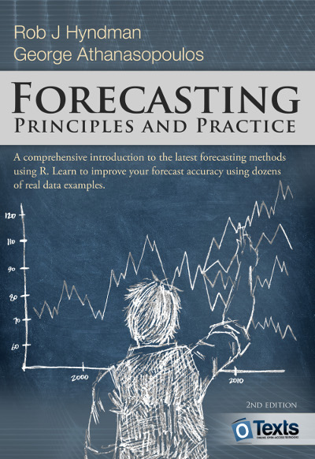

# Welcome {-}

```{r, echo=FALSE, out.width="50%"}

```

Welcome to our online textbook on forecasting.  This textbook is intended to provide a comprehensive introduction to forecasting methods and to present enough information about each method for readers to be able to use them sensibly. We don't attempt to give a thorough discussion of the theoretical details behind each method, although the references at the end of each chapter will fill in many of those details.

The book is written for three audiences: (1)&nbsp;people finding themselves doing forecasting in business when they may not have had any formal training in the area; (2)&nbsp;undergraduate students studying business; (3)&nbsp;MBA students doing a forecasting elective. We use it ourselves for a third-year subject for students undertaking a Bachelor of Commerce or a Bachelor of Business degree at Monash University, Australia.

For most sections, we only assume that readers are familiar with introductory statistics, and with high-school algebra. There are a couple of sections that also require knowledge of matrices, but these are flagged.

At the end of each chapter we provide a list of "further reading". In general, these lists comprise suggested textbooks that provide a more advanced or detailed treatment of the subject. Where there is no suitable textbook, we suggest journal articles that provide more information.

We use R throughout the book and we intend students to learn how to forecast with R. R is free and available on almost every operating system. It is a wonderful tool for all statistical analysis, not just for forecasting. See [Using R](http://OTexts.org/fpp2/using-r.html) for instructions on installing and using R.

All R examples in the book assume you have loaded the `fpp2` package, available on CRAN, using `library(fpp2)`. This will automatically load several other packages including `forecast` and `ggplot2`, as well as all the data used in the book.  The `fpp2` package requires at least version 8.0 of the `forecast` package and version 2.0.0 of the `ggplot2` package.

We will use the `ggplot2` package for all graphics. If you want to learn how to modify the graphs, or create your own `ggplot2` graphics that are different from the examples shown in this book, please either read the [ggplot2 book](https://www.amazon.com/dp/0387981403?tag=otexts-20), or do the ggplot2 course on [DataCamp](https://www.datacamp.com/courses/data-visualization-with-ggplot2-1).

There is also a [DataCamp course based on this book](https://www.datacamp.com/courses/forecasting-using-r) which provides an introduction to some of the ideas in Chapters 2, 3, 7 and 8, plus a brief glimpse at a few of the topics in Chapters 9 and 11.

The book is different from other forecasting textbooks in several ways.

 * It is free and online, making it accessible to a wide audience.
 * It uses R, which is free, open-source, and extremely powerful software.
 * The online version is continuously updated. You don't have to wait until the next edition for errors to be removed or new methods to be discussed. We will update the book frequently.
 * There are dozens of real data examples taken from our own consulting practice. We have worked with hundreds of businesses and organizations helping them with forecasting issues, and this experience has contributed directly to many of the examples given here, as well as guiding our general philosophy of forecasting.
 * We emphasise graphical methods more than most forecasters. We use graphs to explore the data, analyse the validity of the models fitted and present the forecasting results.

###Changes in the second edition {-}

The most important change in edition 2 of the book is that we have restricted our focus to *time series forecasting*. That is, we no longer consider the problem of cross-sectional prediction. Instead, all forecasting in this book concerns prediction of data at future times using observations collected in the past.

We have also simplified the chapter on exponential smoothing, and added new chapters on dynamic regression forecasting, hierarchical forecasting and practical forecasting issues. We have added new material on combining forecasts, handling complicated seasonality patterns, dealing with hourly, daily and weekly data, forecasting count time series, and we have added several new examples involving electricity demand, online shopping, and restaurant bookings. We have also revised all existing chapters to bring them up-to-date with the latest research, and we have carefully gone through every chapter to improve the explanations where possible, to add newer references, to add more exercises, and to make the R code simpler.

Helpful readers of the earlier versions of the book let us know of any typos or errors they had found. These were updated immediately online. No doubt we have introduced some new mistakes, and we will correct them online as soon as they are spotted. Please continue to [let us know](https://otexts.typeform.com/to/wQom0H) about such things.

###Please note {-}

This second edition is still incomplete, especially the later chapters. We should have it finished by the end of 2017. A print edition will follow, probably in early 2018.

We have used the latest v8.3 of the forecast package in preparing this book. The current CRAN version is 8.2, and a few examples will not work if you have v8.2.

&nbsp;

Happy forecasting!

Rob J Hyndman<br>
George Athanasopoulos

`r format(Sys.time(), "%B %Y")`

